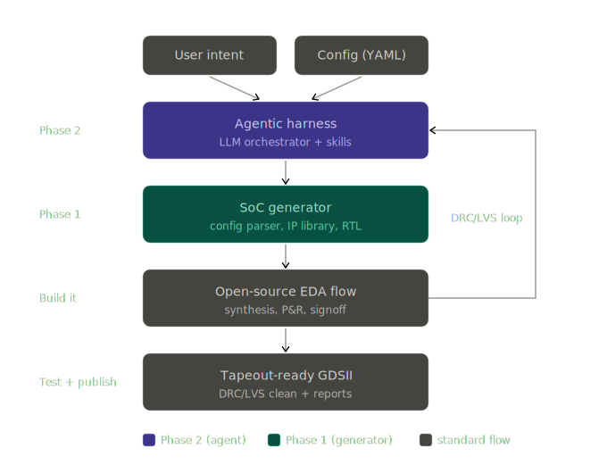

<br />
<p align="center"></p>

<h1 align="center">MOSAIC-SoC</h1>

<p align="center">
  <b>A configuration-driven, multi-core RISC-V SoC generator</b><br>
  One declarative <code>mosaic.yaml</code> → a synthesizable heterogeneous SoC, with an explicit gated path toward GF180 tapeout.
</p>

<p align="center">
  IEEE SSCS Chipathon 2026 · Track D (AI/LLM for Circuits) · Target PDK: <b>GF180MCU</b> · Built on <a href="#built-on-x-heep">X-HEEP</a>
</p>

---

## Table of contents

1. [What is MOSAIC-SoC?](#1-what-is-mosaic-soc)
2. [Architecture](#2-architecture)
3. [The single config file](#3-the-single-config-file)
4. [Repository layout](#4-repository-layout)
5. [Prerequisites](#5-prerequisites)
6. [Setup](#6-setup)
7. [Generate the SoC RTL](#7-generate-the-soc-rtl)
8. [Run the simulations & tests](#8-run-the-simulations--tests)
9. [RTL → GDSII hardening (GF180MCU)](#9-rtl--gdsii-hardening-gf180mcu)
10. [Config reference](#10-config-reference)
11. [Project status](#11-project-status)
12. [Using the agentic harness (oh-my-soc)](#12-using-the-agentic-harness-oh-my-soc)
13. [How LLMs contribute (and how they're checked)](#13-how-llms-contribute-and-how-theyre-checked)
14. [Extending the SoC](#14-extending-the-soc)
15. [Built on X-HEEP](#built-on-x-heep)

---

## 1. What is MOSAIC-SoC?

MOSAIC-SoC turns a **single YAML file** into a complete heterogeneous multi-core RISC-V
SoC — choosing the cores, their counts, the memory, the bus fabric, the dispatch
services, and the peripherals. RTL generation and simulation are operational; the
open-source **GF180MCU** implementation flow is fail-closed until its bound SoC RTL,
32-KiB SRAM views, and physical checks are supplied and completed.

It is built on EPFL's [X-HEEP](#built-on-x-heep) single-core MCU, extended into a
**config-driven multi-core generator**:

- **Heterogeneous "Big.LITTLE" cores** — a **14-core catalog** behind one interface:
  application-class cores (CVA6 32-bit, and Berkeley's RV64 **Rocket** + **BOOM v3** —
  all three sim-only), industry MCU cores (cv32e20, cv32e40x, Ibex, PicoRV32, and
  **Hazard3** — the RP2350 core, integrated _by the Phase-2 wrapper mechanism_), a bare
  RISC-V core (Snitch), the native cv32e40p/cv32e40px variants, and ultra-tiny serial
  cores (SERV, QERV, FazyRV) — mixed within each core's qualified profile.
- **Standard Core Interface (SCI)** — every core is wrapped to a common OBI 1.3 interface,
  so adding a core is one wrapper + one `.core` descriptor.
- **Task Dispatch Unit (TDU)** — a small memory-mapped dispatch/telemetry block that
  queues descriptors, wakes dormant workers, and tracks CPI/energy proxies. TITAN
  software chooses the final target hart; hardware preserves that `core_hint`.
- **Open EDA only** — Verilator + cocotb for verification, LibreLane (Yosys + OpenROAD +
  Magic/KLayout/Netgen) for hardening.

**Proof-of-concept SoC:** 1× cv32e20 (TITAN) + 2× FazyRV-CHUNK8 (ATLAS) + 4× SERV (NANO),
32 KB SRAM, 2 KB boot ROM, UART/GPIO/timer/SPI, TDU, iDMA — targeting **1.249 mm²** on
GF180MCU once the physical inputs listed in section 9 are available.

> New to the project? Follow the **[hands-on tutorial](tutorial/README.md)** for a
> small YAML → RTL → all-hart simulation example, followed by deterministic and
> OpenCode Go harness walkthroughs with expected output at every stage.

---

## 2. Architecture

<p align="center"></p>

### Core taxonomy (Big.LITTLE)

| Tier      | Role            | Cores                                    | Area                     | Purpose                  |
| --------- | --------------- | ---------------------------------------- | ------------------------ | ------------------------ |
| **TITAN** | orchestrator    | cv32e20 (CVE2), cv32e40x, Ibex, CVA6†    | ~14–17 kGE (CVA6 larger) | RTOS / task dispatch     |
| **ATLAS** | signal/protocol | FazyRV-CHUNK8, PicoRV32, Snitch, Hazard3 | ~1–20 kGE                | streaming / conditioning |
| **NANO**  | always-on       | SERV, QERV                               | ~0.2–3 kGE               | sensor polling           |

> † **CVA6** is integrated for **simulation only** (32-bit `cv32a65x`-derived config, single
> AXI4 master bridged to OBI). It is **excluded from the GF180 tapeout** (area). PicoRV32 and
> Snitch are sim-verified workers; both are tapeout-eligible.
> **Rocket** and **BOOM v3** (RV64, chipyard 1.14.0 tile extractions, TileLink-C bridged to
> OBI with cacheable/uncached window translation) are likewise **simulation-only** — see
> [`hw/vendor/mosaic/berkeley/README.md`](hw/vendor/mosaic/berkeley/README.md).

### Key blocks

- **Standard Core Interface (SCI)** — a thin (~100–200 line) wrapper per core
  (`hw/sci/<core>_sci.sv`) that presents identical OBI 1.3 instruction + data ports plus a
  clock-gate/wake handshake. Every native bus is converted to OBI here: Wishbone
  (SERV/QERV/FazyRV), req/gnt (Ibex), PicoRV32's unified memory port, Snitch's reqrsp
  channel, CVA6's AXI4 master (via a burst-capable AXI→OBI bridge), and Rocket/BOOM's
  TileLink-C master (via a window-translating TL→OBI bridge).
- **Task Dispatch Unit (TDU)** — `hw/tdu/`, memory-mapped at `0x200A0000`. An 8-deep task
  FIFO, per-hart `WAKE_REQ` → `core_wake` pulses, a CPI-estimate array and an energy
  counter. Worker cores boot **dormant** and are released by a TDU wake.
- **iDMA** (pulp-platform) — `hw/vendor/mosaic/idma/`, replaces x-heep's simple DMA
  (register frontend + ND midend + native OBI backend, no protocol conversion).
- **Bus fabric** — a parameterized OBI N×M crossbar (`pulp-platform/obi`), sized
  automatically by the generator; banked SRAM with per-bank clock gating.

### How generation works

```
mosaic.yaml ──> util/xheep_gen/mosaic_config.py ──> XHeep config object
                                                          │
                  Mako templates (*.sv.tpl) <─────────────┘
                          │  rendered by util/xheep_gen/mcu_gen.py
                          ▼
                  generated *.sv  ──> FuseSoC (.core files) ──> Verilator / LibreLane
```

---

## 3. The single config file

Everything is driven by one declarative file. This is the PoC (`mosaic.yaml`):

```yaml
soc:
  name: mosaic_poc_alpha
  pdk: gf180mcu

  cores:
    - ip: cv32e20 # TITAN — CVE2, 2-stage, RV32E/M (orchestrator)
      isa: rv32emc
      count: 1
      role: titan

    - ip: fazyrv # ATLAS — chunk-serial datapath
      isa: rv32i
      chunksize: 8 # per-core-type parameter
      count: 2
      role: atlas

    - ip: serv # NANO — bit-serial, ~200 GE each
      isa: rv32i
      count: 4
      role: nano

  memory:
    sram_kb: 32
    boot_rom_kb: 2

  bus: obi # Open Bus Interface

  scheduler:
    tdu: true # Task Dispatch Unit
    mode: dynamic # static | dynamic | power-aware

  peripherals: [uart, gpio, timer, spi]
```

| Field                     | Drives                                                                                                                                                                                                                                       |
| ------------------------- | -------------------------------------------------------------------------------------------------------------------------------------------------------------------------------------------------------------------------------------------- |
| `cores[].ip`              | which core IP + its SCI wrapper + FuseSoC dependency                                                                                                                                                                                         |
| `cores[].count`           | how many copies (each gets its own OBI ports, hart_id, debug, wake)                                                                                                                                                                          |
| `cores[].role`            | tier → interrupt routing, clock-gate policy, TDU priority (`titan` boots immediately; workers boot dormant)                                                                                                                                  |
| `cores[].*`               | extra fields (e.g. `chunksize`, `boot_addr`, `memdly1`) → per-core params                                                                                                                                                                    |
| `memory`                  | SRAM size (banked) + boot ROM size                                                                                                                                                                                                           |
| `bus`                     | interconnect fabric: `obi` (varlat crossbar), `log` (two-tier logarithmic interconnect: fixed-latency `tcdm_interconnect` over word-interleaved banks + varlat peripheral tier), or `floonoc` (floogen-generated AXI NoC + OBI↔AXI bridges) |
| `bus_opts`                | per-fabric knobs: `log: {topology: lic, num_banks: auto\|N}` (current backend supports LIC only and needs banks ≥ bus masters), `floonoc: {route_algo: ID, endpoints: compact}`                                                              |
| `target`                  | implementation intent: `rtl` (default), `simulation`, or `tapeout`; `tapeout` requires the exact canonical GF180/OBI 7-hart PoC topology, memory, TDU policy, and peripherals                                                                |
| `scheduler.tdu` / `.mode` | enable the TDU + its scheduling policy                                                                                                                                                                                                       |
| `peripherals`             | which peripheral IPs are in the memory map                                                                                                                                                                                                   |

---

## 4. Repository layout

```
mosaic.yaml                 # the PoC config (default for `make mosaic-gen`)
oh-my-soc                   # harness launcher (./oh-my-soc <skill> <cmd>, §12)
pyproject.toml              # harness packaging (pip install -e . -> `oh-my-soc`)
configs/                    # more configs: mosaic_*.yaml + x-heep *.hjson/*.py
harness/                    # oh-my-soc agentic harness: 10 deterministic skills
  skills/                   #   config-author, soc-from-prompt, flow-runner,
                            #   wrapper-smith, tb-smith, tb-matrix, drc-triage,
                            #   doc-gen, topo-viz, setup (driver picker)
  llm.py                    #   optional api-driver intent translation (keys never stored)
  templates/                #   wrapper family + TB templates (*.mako)
demo/                       # scripted walkthroughs (prompt→SoC, wrap-a-core)
.claude/skills/             # skill cards — discovered by Claude Code AND oh-my-pi
.omp/tools/                 # oh-my-pi custom-tool shim (oh_my_soc)
hw/
  core-v-mini-mcu/          # the SoC RTL templates (*.sv.tpl) — generated into *.sv
  sci/                      # SCI wrappers (serv/fazyrv/ibex/picorv32/snitch/cva6/rocket/boom/hazard3)
  tdu/                      # Task Dispatch Unit (rtl + tb + .core)
  ip/                       # OBI helpers (obi_fifo, ...)
  vendor/mosaic/            # vendored cores + iDMA (serv, fazyrv, ibex, picorv32, snitch, cva6,
                            #   berkeley = Rocket+BOOM tile closures, hazard3,
                            #   idma, axi_obi + tl_obi bridges)
util/xheep_gen/             # the Python generator (mcu_gen.py, mosaic_config.py, cpu/)
tb/                         # testbenches (see §8)
  mosaic/                   #   multi-core cpu_subsystem harness (SV + cocotb)
  mosaic_soc/               #   full-SoC functional sim + TDU wake-and-run demo
  sci/                      #   tb-smith-generated single-hart SCI TBs (per core)
  tl_obi/                   #   TileLink→OBI bridge unit TB
  idma/                     #   iDMA cocotb tests
  tdu/                      #   TDU SoC-level cocotb test
flow/librelane/             # RTL→GDSII hardening flow for GF180MCU
scripts/                    # build/sim/synth helpers (fusesoc-setup.sh, ...)
refs/                       # READ-ONLY reference IPs (cores, interconnects, SoCs, tools + oh-my-pi)
```

> **Never modify `refs/`** (read-only references). **Never commit generated `.sv`** — only
> `.sv.tpl` templates are version-controlled.

---

## 5. Prerequisites

You can install everything natively, or use the [oss-cad-suite](https://github.com/YosysHQ/oss-cad-suite-build)
bundle (it ships Verilator, Icarus, cocotb and a Python). Versions below are what this
project is developed/verified against.

| Tool                                            | Needed for                                                   | Verified version                               |
| ----------------------------------------------- | ------------------------------------------------------------ | ---------------------------------------------- |
| **Python** ≥ 3.10                               | the generator + FuseSoC                                      | 3.14                                           |
| **GNU Make**                                    | top-level flow                                               | 4.4                                            |
| **Verilator** 5.x                               | all RTL simulation                                           | **5.050** (stable — see note)                  |
| **cocotb** 2.x                                  | the cocotb test harnesses (`tb/mosaic`, `tb/idma`, `tb/tdu`) | 2.1                                            |
| **RISC-V bare-metal GCC** (`riscv32-*-elf-gcc`) | full-SoC sim firmware                                        | 16.1                                           |
| **FuseSoC** + edalize                           | dependency resolution / register gen                         | auto-installed (see §6)                        |
| _Icarus Verilog_ (optional)                     | —                                                            | 13.0 — _cannot_ compile the full SoC, see note |
| **Nix** (flakes) + GF180 PDK (optional)         | RTL→GDSII signoff                                            | 2.32                                           |

- **FuseSoC is installed automatically** into a project-local Python venv (`.venv/`) the
  first time you run a `make` target — from `util/python-requirements.txt`. You don't need
  to install it by hand.
- **Use a stable Verilator (5.050 recommended), not an oss-cad-suite nightly.** A nightly
  build (5.047-devel) was found to miscompile cv32e40x's load-use-hazard stall via its DFG
  optimizer, breaking the all-TITAN SMP demo (`-fno-dfg`/`-O0` also work around it). The
  `tb/mosaic_soc/*` scripts default to a pinned 5.050; point `VERILATOR_PIN=<path>` at your
  own build, or `VERILATOR_PIN=` (empty) to just use whatever `verilator` is on `PATH`.
- **RISC-V toolchain:** the full-SoC sim scripts default to
  `RISCV_TC=/opt/riscv32-gnu-toolchain-elf-bin/bin/riscv32-unknown-elf`. Override with
  `RISCV_TC=<prefix>` (the prefix before `-gcc`). Note this toolchain has **no rv32imc
  multilib**, so the demo programs are assembled `-march=rv32i` and linked with `ld`
  directly (the scripts handle this).
- **Icarus note:** Icarus is event-driven but cannot parse x-heep's OpenTitan/pulp
  SystemVerilog (package-function param defaults, named struct-pattern params). The
  `tb/mosaic_soc/run_icarus.sh` harness documents exactly where it fails. **Use Verilator.**

---

## 6. Setup

```bash
git clone https://github.com/MILOUDIAS/MOSAIC-SoC.git
cd MOSAIC-SoC

# The Python venv (with FuseSoC) is created automatically on the first make target.
# To create/refresh it explicitly:
make venv          # builds .venv/ from util/python-requirements.txt

# Make sure your simulators are on PATH (native install or oss-cad-suite):
source /path/to/oss-cad-suite/environment   # if using the bundle
verilator --version                          # expect 5.x
```

---

## 7. Generate the SoC RTL

Render the RTL templates from a config (this is the core of the "config-driven" flow):

```bash
# Generate the PoC SoC (mosaic.yaml): 1x cv32e20 + 2x fazyrv + 4x serv + TDU + iDMA
make mosaic-gen

# Generate a different config:
make mosaic-gen MOSAIC_CFG=configs/mosaic_all_cores.yaml   # all 5 core types
make mosaic-gen MOSAIC_CFG=configs/mosaic_wake_demo.yaml   # the 3-core wake demo (§8)
```

`make mosaic-gen` renders every `*.sv.tpl` into a `*.sv`, then runs the FuseSoC register
generators (via `scripts/fusesoc-setup.sh`, which excludes `refs/` so FuseSoC doesn't crash
on reference fixtures). Re-run it **after any `.sv.tpl` change** — stale generated RTL
causes confusing errors.

> Single-core x-heep generation is still available via `make mcu-gen CPU=... BUS=...` — see
> `make help`.

---

## 8. Run the simulations & tests

All simulations use **Verilator**. Each runner generates the RTL it needs, builds, runs,
and restores the default config — so they're self-contained.

### 8.1 Full-SoC TDU wake-and-run demo ✅ (the headline test)

The complete SoC (testharness → `x_heep_system` → `core_v_mini_mcu`) where TITAN boots,
**wakes both workers via the TDU**, and each woken worker runs its own program through the
shared bus and reports back:

```bash
tb/mosaic_soc/run.sh
```

Expected (3 real cores — cv32e20 TITAN + fazyrv ATLAS + serv NANO):

```
write hart=0 addr=0x200a000c: data=0x00000006   # TITAN writes TDU WAKE_REQ
write hart=1 addr=0x00003004: data=0xa71a5000    # ATLAS (fazyrv) sentinel
write hart=2 addr=0x00003008: data=0x4e414e00    # NANO  (serv)   sentinel
### RESULT: EXIT SUCCESS — full multi-core SoC executed the program ✓
```

The diagnostic top (dumps sentinels, wake latches, fetch traces) builds with:

```bash
tb/mosaic_soc/build_diag.sh
```

**Production firmware on the full 7-hart PoC** — the same full-SoC sim, but with the
default `mosaic.yaml` (1 cv32e20 + 2 fazyrv + 4 serv) running the production C firmware
(`sw/firmware/` → `mosaic_fw.hex`): TITAN's `titan_main.c` configures the TDU, queues all
6 task descriptors, releases the workers (push-all-then-wake), and each worker pops a
unique descriptor from TDU `TASK_POP`, runs its workload, and reports into its per-slot
sentinel. Exits at ~300k cycles:

```bash
tb/mosaic_soc/run_fw.sh
# ### RESULT: EXIT SUCCESS — production firmware ran on the full 7-hart SoC ✓
```

**Newly-integrated cores (PicoRV32 · Snitch · CVA6)** — the same wake demo runs unchanged
with each of the three cores added in 2026-07, plus a combined config where a CVA6 TITAN
wakes a Snitch worker and a PicoRV32 worker over the shared bus:

```bash
MOSAIC_CFG=configs/mosaic_picorv32.yaml  tb/mosaic_soc/run.sh   # 2× PicoRV32 workers
MOSAIC_CFG=configs/mosaic_snitch.yaml    tb/mosaic_soc/run.sh   # 2× Snitch workers
MOSAIC_CFG=configs/mosaic_cva6.yaml      tb/mosaic_soc/run.sh   # CVA6 TITAN (32-bit, sim-only)
MOSAIC_CFG=configs/mosaic_new_cores.yaml tb/mosaic_soc/run.sh   # CVA6 + Snitch + PicoRV32 together → EXIT SUCCESS
```

> CVA6 is integrated for **simulation only** (32-bit `cv32a65x`-derived config; single AXI4
> master → `hw/vendor/mosaic/axi_obi/xheep_axi_burst_to_obi.sv`). It stays out of the GF180
> tapeout.

**Berkeley RV64 tiles (Rocket · BOOM v3)** — extracted chipyard 1.14.0 tile closures
(`hw/vendor/mosaic/berkeley/`) behind a TileLink-C→OBI window bridge: code is fetched
through the tiles' cacheable DRAM alias (`0x8000_0000|addr` → SRAM) while sentinels/TDU
and `soc_ctrl` go through uncached device windows, so shared state needs no coherence
hardware. The bridge has its own self-checking unit TB (`tb/tl_obi/run.sh`, 24 checks):

```bash
tb/tl_obi/run.sh                                                # TL→OBI bridge unit TB
MOSAIC_CFG=configs/mosaic_rocket.yaml   tb/mosaic_soc/run.sh    # 2× Rocket RV64 workers
MOSAIC_CFG=configs/mosaic_boom.yaml     tb/mosaic_soc/run.sh    # 2× BOOM v3 OoO workers
MOSAIC_CFG=configs/mosaic_berkeley.yaml tb/mosaic_soc/run.sh    # Rocket + BOOM together → EXIT SUCCESS
MOSAIC_CFG=configs/mosaic_rocket_titan.yaml tb/mosaic_soc/run_generic.sh # Rocket hart 0 + SERV
MOSAIC_CFG=configs/mosaic_boom_titan.yaml   tb/mosaic_soc/run_generic.sh # BOOM hart 0 + SERV
```

> Rocket and BOOM are **simulation-only** (RV64 + caches; never in the GF180 tapeout).
> Both tiles come from ONE chipyard elaboration so the combined build has no module-name
> collisions — see [`hw/vendor/mosaic/berkeley/README.md`](hw/vendor/mosaic/berkeley/README.md)
> for full provenance and the window-translation scheme.

**All-TITAN SMP demo** — 4 orchestrator-class cores (2× cv32e20 + 2× cv32e40x) booting
together, on any of the three bus fabrics:

```bash
MOSAIC_CFG=configs/mosaic_titan_obi.yaml     tb/mosaic_soc/run_titan.sh   # EXIT SUCCESS
MOSAIC_CFG=configs/mosaic_titan_log.yaml     tb/mosaic_soc/run_titan.sh
MOSAIC_CFG=configs/mosaic_titan_floonoc.yaml tb/mosaic_soc/run_titan.sh
```

> See [`tb/mosaic_soc/README.md`](tb/mosaic_soc/README.md) for the single-core functional
> sim and the five RTL fixes this demo required (packed wake ports, the per-hart array
> range fix, the SCI OBI-bridge fix, and the FazyRV clock-stall adapter).

### 8.2 Multi-core SCI wake-loop ✅

Builds the **real generated `cpu_subsystem`** and exercises the SCI-wrapped serial cores
against per-hart OBI memories — proves dormancy + per-hart wake + execution.

```bash
tb/mosaic/run.sh         # pure-SV Verilator TB (no cocotb / GCC needed) — 3/3 cores
tb/mosaic/cocotb/run.sh  # cocotb TB: dormant → selective-wake → all-wake loop
```

Expected (cocotb): `TESTS=1 PASS=1 FAIL=0` — `serv`, `qerv`, `fazyrv` all
`dormant → woken → executed`.

### 8.3 Task Dispatch Unit tests ✅

```bash
tb/tdu/soc/cocotb/run.sh     # SoC-level reg-bus tap test (SCHED_MODE, FIFO, WAKE_REQ)
tb/tdu/soc/cocotb/run.sh bug # also run the original buggy tap the test is designed to catch
```

The TDU also has a self-checking **unit** testbench (`hw/tdu/tb/tdu_tb.sv`, 23 checks incl. targeted auto-wake),
built/run via its FuseSoC core `hw/tdu/tdu.core`.

### 8.4 iDMA tests ✅

```bash
tb/idma/cocotb/run.sh    # mem-to-mem copy at per-block AND SoC (arbitrated) level
```

Expected: `TESTS=1 PASS=1` at each level (no RTL generation needed — iDMA is static RTL).

### 8.5 Alternative bus fabrics ✅

```bash
tb/log_xbar/run.sh                # bus:log — LIC parallel banks / RR / periph tier / ERROR (T1..T5)
tb/floonoc/cocotb/run.sh          # bus:floonoc — OBI<->AXI bridge loopback (stage 1)
tb/floonoc/cocotb/run.sh stage2   # …plus loopback through the generated FlooNoC (stage 2)

# The full-SoC TDU wake-and-run demo (§8.1) also runs on both new fabrics:
MOSAIC_CFG=configs/mosaic_wake_demo_log.yaml tb/mosaic_soc/run.sh   # EXIT SUCCESS
MOSAIC_CFG=configs/mosaic_floonoc.yaml       tb/mosaic_soc/run.sh   # EXIT SUCCESS
```

### 8.6 Harness-generated per-core TBs + scripted demos ✅

`tb-smith` generates a self-checking single-hart SCI testbench per core
(dormancy → wake → liveness → sentinel) under `tb/sci/<core>/`:

```bash
./oh-my-soc tb-smith run picorv32     # [OK] TB PASS — 237 cycles
./oh-my-soc tb-smith run hazard3      # [OK] TB PASS — 229 cycles
bash demo/01_soc_from_prompt.sh       # prompt→SoC pipeline to EXIT SUCCESS (CI-able)
bash demo/02_wrap_new_core.sh         # the Hazard3 wrap-a-core walkthrough
```

`tb-matrix` tests the **combinations** — axes derived live from the core
registry, a pairwise covering array (~250 configs; impossible pairs reported
_blocked with a reason_, never dropped) plus ~30 curated sim corners, gated
validate → render → all-hart liveness with crash-safe resume:

```bash
./oh-my-soc tb-matrix run --tier validate    # schema oracle: all 248, seconds
./oh-my-soc tb-matrix run --tier sim --limit 5   # resumable EXIT SUCCESS campaign
./oh-my-soc tb-matrix report                 # cumulative build/tb_matrix/report.json
```

### 8.7 x-heep application flow (full PoC incl. cv32e20, needs a toolchain)

```bash
make mosaic-gen                 # generate the SoC
make verilator-build            # build the Verilator model via FuseSoC
make app PROJECT=hello_world    # compile an app (needs riscv32 GCC)
make verilator-run              # run firmware on the model
```

---

## 9. RTL → GDSII hardening (GF180MCU)

The LibreLane flow lives in [`flow/librelane/`](flow/librelane/). It is intentionally
fail-closed: a run requires a content-addressed `PHYSICAL_BUNDLE` containing the resolved
`target: tapeout` manifest, flattened SoC RTL, bound chip adapter, and all SRAM views.
This prevents the unbound checked-in adapter or a stale `design.v` from producing a false
signoff claim. A real run also needs **Nix (flakes) + ~20 GB disk** and is multi-hour.

```bash
cd flow/librelane
nix-shell shell.nix          # LibreLane 3.0.0 + GF180 EDA tools
make clone-pdk               # wafer-space gf180mcu @ 1.8.0

# RTL generation remains available without physical collateral:
make mosaic-gen MOSAIC_CFG=mosaic.yaml

# Physical runs require a validated bundle (format documented below):
make preflight-chip PHYSICAL_BUNDLE=/abs/path/to/bundle
make harden SLOT=mosaic PHYSICAL_BUNDLE=/abs/path/to/bundle
make harden-nodrc PHYSICAL_BUNDLE=/abs/path/to/bundle  # dev only

# Classic flow — SoC core only, no pad ring (early synth/PnR/area):
make classic PHYSICAL_BUNDLE=/abs/path/to/bundle
```

> Status: the GF180 pad frame elaborates clean, but this repository does not yet contain a
> bound `mosaic_soc_core` or qualified 32-KiB SRAM bundle. Consequently `make harden`
> fails before LibreLane unless those real inputs are supplied; no DRC/LVS-clean result is
> currently claimed.
> See [`flow/librelane/README.md`](flow/librelane/README.md).

---

## 10. Config reference

| Config                                        | Cores                                                         | Used by                                                                |
| --------------------------------------------- | ------------------------------------------------------------- | ---------------------------------------------------------------------- |
| `mosaic.yaml`                                 | **PoC:** 1× cv32e20 + 2× fazyrv + 4× serv                     | default for `make mosaic-gen`, the GDS flow                            |
| `configs/mosaic_wake_demo.yaml`               | 1× cv32e20 + 1× fazyrv + 1× serv (per-core boot addr)         | `tb/mosaic_soc/run.sh` (§8.1)                                          |
| `configs/mosaic_sim.yaml`                     | serv + qerv + fazyrv (all workers)                            | `tb/mosaic/*` (§8.2)                                                   |
| `configs/mosaic_all_cores.yaml`               | cv32e20 + ibex + fazyrv + qerv + serv                         | acceptance (renders all 5 SCI branches)                                |
| `configs/mosaic_log.yaml`                     | serv + qerv + fazyrv on `bus: log` (16 il banks)              | `tb/log_xbar/run.sh`                                                   |
| `configs/mosaic_log_poc.yaml`                 | PoC topology on `bus: log` (32×2 KB banks)                    | full-size log generation/lint                                          |
| `configs/mosaic_wake_demo_log.yaml`           | wake demo on `bus: log` (32 banks: +8 TB ext masters)         | `MOSAIC_CFG=… tb/mosaic_soc/run.sh`                                    |
| `configs/mosaic_floonoc.yaml`                 | wake demo on `bus: floonoc` (FlooNoC AXI NoC)                 | `MOSAIC_CFG=… tb/mosaic_soc/run.sh`, `tb/floonoc/cocotb/run.sh stage2` |
| `configs/mosaic_picorv32.yaml`                | cv32e20 + 2× PicoRV32 (wake demo)                             | `MOSAIC_CFG=… tb/mosaic_soc/run.sh` (§8.1)                             |
| `configs/mosaic_snitch.yaml`                  | cv32e20 + 2× Snitch (wake demo)                               | `MOSAIC_CFG=… tb/mosaic_soc/run.sh` (§8.1)                             |
| `configs/mosaic_cva6.yaml`                    | **CVA6 TITAN** (sim-only) + fazyrv + serv                     | `MOSAIC_CFG=… tb/mosaic_soc/run.sh` (§8.1)                             |
| `configs/mosaic_new_cores.yaml`               | **CVA6 + Snitch + PicoRV32** — the combined new-cores demo    | `MOSAIC_CFG=… tb/mosaic_soc/run.sh` (§8.1)                             |
| `configs/mosaic_titan_{obi,log,floonoc}.yaml` | all-TITAN SMP: 2× cv32e20 + 2× cv32e40x                       | `MOSAIC_CFG=… tb/mosaic_soc/run_titan.sh` (§8.1)                       |
| `configs/mosaic_rocket.yaml`                  | cv32e20 + 2× **Rocket** RV64 (sim-only)                       | `MOSAIC_CFG=… tb/mosaic_soc/run.sh` (§8.1)                             |
| `configs/mosaic_boom.yaml`                    | cv32e20 + 2× **BOOM v3** RV64 OoO (sim-only)                  | `MOSAIC_CFG=… tb/mosaic_soc/run.sh` (§8.1)                             |
| `configs/mosaic_berkeley.yaml`                | **Rocket + BOOM** together under a cv32e20 TITAN              | `MOSAIC_CFG=… tb/mosaic_soc/run.sh` (§8.1)                             |
| `configs/mosaic_{rocket,boom}_titan.yaml`     | singleton Berkeley **TITAN** + SERV worker (sim-only)         | `MOSAIC_CFG=… tb/mosaic_soc/run_generic.sh` (§8.1)                     |
| `configs/mosaic_hazard3.yaml`                 | cv32e20 + 2× **Hazard3** (AHB-Lite, wrapper-smith integrated) | `MOSAIC_CFG=… tb/mosaic_soc/run.sh` (§8.1)                             |

Pass any of them with `MOSAIC_CFG=<path>` to `make mosaic-gen`, or via `MOSAIC_CFG`/`RISCV_TC`
env vars to the `tb/mosaic_soc` scripts.

---

## 11. Project status

**Phase 1 — config-driven multi-core generator: working.**

- ✅ `mosaic.yaml` → `make mosaic-gen` renders the full multi-core SoC; per-core master
  indices, hart IDs, interrupt routing, and the multi-master `system_bus`.
- ✅ SCI/native catalog — **14 cores** behind generated OBI master ports: cv32e20,
  cv32e40p/px/x, Ibex, FazyRV, QERV, SERV, Hazard3, PicoRV32, Snitch, CVA6, Rocket, and
  BOOM. CVA6/Rocket/BOOM are **simulation-only**; the physical preflight independently
  validates every tapeout bundle.
- ✅ TDU (8-deep FIFO, per-hart wake, CPI/energy) — unit + SoC tests pass.
- ✅ iDMA integrated (OBI backend) — per-block + SoC mem-to-mem tests pass.
- ✅ **Full multi-core SoC elaborates clean** (`verilator --lint-only`, 837 modules) — the
  first time the whole top was ever elaborated; surfaced & fixed several latent
  port/type/package bugs.
- ✅ **Full-SoC functional sim passes** — single-core boot-and-run, **and the 3-core TDU
  wake-and-run demo reaches `EXIT SUCCESS`** (TITAN wakes ATLAS + NANO; each runs its own
  program and writes its sentinel). Validated against the cocotb regression too.
- ✅ **All 12 cores sim-verified in the full SoC** — PicoRV32, Snitch, and CVA6 each reach
  `EXIT SUCCESS` in the TDU wake demo, plus a combined config (CVA6 TITAN + Snitch + PicoRV32),
  an all-TITAN 4-core SMP demo (2× cv32e20 + 2× cv32e40x) across all three bus fabrics,
  the Berkeley RV64 tiles (Rocket, BOOM v3, and both together) behind the TL→OBI window
  bridge, and Hazard3 (AHB-Lite) integrated end-to-end by the Phase-2 wrapper mechanism.
- ✅ **Full regression green** under pinned Verilator 5.050 (unit/SoC TDU, iDMA,
  log-xbar, FlooNoC, SCI cocotb, TL→OBI bridge, 11 wake demos, 3 all-TITAN SMP, production
  firmware, the no-LLM prompt→SoC pipeline, tb-smith single-hart TBs, and generator pytest).
  A nightly-Verilator DFG miscompile of cv32e40x was root-caused and pinned around.
- 🔜 LibreLane GF180 hardening: flow wired and fail-closed; a bound adapter, qualified
  32-KiB SRAM bundle, and completed DRC/LVS/STA evidence remain before tapeout signoff.

**Phase 2 — agentic harness (oh-my-soc): delivered** ,
[`harness/README.md`](harness/README.md), [`demo/README.md`](demo/README.md)):

- ✅ **First-class executable with an omp-style first run**: `./oh-my-soc <skill> <cmd>`
  (zero-install launcher, any cwd) or a PATH `oh-my-soc` via `pip install -e .`;
  `python -m harness` stays equivalent, `--json` gives the raw SkillResult everywhere.
  A bare interactive `./oh-my-soc` launches the **driver picker** (`oh-my-soc setup`):
  `deterministic` (default, CI-safe) · `claude` (Claude Code) · `omp` (oh-my-pi) ·
  `api` (built-in Anthropic/OpenAI-compatible/OpenCode Go multi-turn tool agent;
  keys never stored). `oh-my-soc agent "<request>"` streams its plan, typed tool calls, live EDA
  output, gate results, recovery, and final evidence. The in-process drivers provide
  normalized JSONL and private durable journals for headless runs; Claude/omp remain
  interactive native-UI handoffs.
- ✅ **Prompt → verified SoC**: `./oh-my-soc soc-from-prompt run "<request>" --run`
  drives config-author → topo-viz gate → mosaic-gen → topology-generic all-hart
  liveness to **EXIT SUCCESS** with no LLM in the loop; LLM agents (Claude Code, oh-my-pi) compose
  the same deterministic gates through shared skill cards in `.claude/skills/`.
- ✅ **Wrap any core/IP — straight from GitHub**: `wrapper-smith fetch <url>[@commit]`
  (pinned clone, license detection with a GPL gate, provenance folded into the vendored
  `.core`), then analyze (verible→yosys→regex port ladder, 9-family bus classifier) and
  scaffold (SCI wrapper + all 8 integration touchpoints incl. the FuseSoC `depend:` edge,
  followed by a full FuseSoC-graph resolution smoke); `tb-smith` generates and runs the
  verification (single-hart TB + wake demo). **Proven end-to-end on Hazard3** (RP2350's
  RV32IMC, AHB-Lite — a previously unproven family): classified at 1.00 confidence,
  scaffolded, filled, TB PASS in 229 cycles, full-SoC wake demo EXIT SUCCESS.
- ✅ **Combination coverage (`tb-matrix`)**: the integration _space_ is testable, not just
  the shipped configs — axes (cores × roles × counts × fabrics × ISA/param variants ×
  scheduler × memory × peripherals × topology shape) derive live from the core registry,
  a deterministic pairwise covering array (248 configs, every legal value pair; 68
  impossible pairs reported blocked-with-reason) plus 30 curated sim corners run through
  validate → mcu-gen render → all-hart liveness gates with resumable reporting. First
  campaign: 248/248 validate, and three sim EXIT SUCCESSes including two combinations
  never tested before (cv32e20 as a dormant TDU worker; cv32e40p in a multicore SoC).

---

## 12. Using the agentic harness (oh-my-soc)

The Phase-2 harness turns the flows above into **deterministic, gated skills**
that an LLM agent — or you, directly — composes. Invoke as `./oh-my-soc
<skill> <command>` (zero-install launcher; `pip install -e .` gives a PATH
`oh-my-soc`; `python -m harness` is equivalent).

**First run:** a bare interactive `./oh-my-soc` opens the driver picker
(omp-style): `deterministic` / `claude` / `omp` / `api`. Then the shortest
path to a chip is one line:

```bash
./oh-my-soc agent "an SoC with one cv32e20 controller, two picorv32 workers, 64KB sram, tdu, a uart"
```

Full reference (incl. the driver table and `setup` flags):
[`harness/README.md`](harness/README.md); detailed walkthroughs with expected
outputs: [`demo/README.md`](demo/README.md).

### Example A — an SoC from one sentence

```bash
# 1. See how the deterministic grammar reads the request (writes nothing):
./oh-my-soc soc-from-prompt plan \
    "an SoC with one cv32e20 controller, two picorv32 workers, 64KB sram, tdu, a uart"
# [OK] parsed: 1x cv32e20 (titan); 2x picorv32 (atlas); sram 64 KB; tdu on;
#      peripheral uart | repairs: flattened 2x picorv32 workers to per-hart
#      groups; assigned worker boot addresses (0x1000, 0x2000, ...)

# 2. Generate AND verify (config -> semantic checks -> RTL -> all-hart liveness):
./oh-my-soc soc-from-prompt run "<same text>" --run --name my_soc
#   config       ok=True  Generated valid config 'my_soc' -> configs/my_soc.yaml
#   topo_check   ok=True  my_soc.yaml: clean
#   mosaic_gen   ok=True  Flow 'mosaic-gen-config' PASS
#   generic_liveness ok=True  Flow 'tb-soc-generic' PASS <- every hart + EXIT SUCCESS
#   doc          ok=True  Generated config summary

# 3. Visualize + document:
./oh-my-soc topo-viz render configs/my_soc.yaml -o build/my_soc_topo.html
./oh-my-soc doc-gen config configs/my_soc.yaml
```

With an agent, use `./oh-my-soc agent "<request>"`. The omp driver launches
oh-my-pi's full interactive TUI (not final-only print mode), Claude owns its
interactive UI, and the API driver runs the in-process bounded tool loop.
Every operation still enters through the typed deterministic harness tools.

### Example B — integrate a core from GitHub (how Hazard3 got in)

```bash
# 1. Fetch: pinned clone + license detection + provenance
./oh-my-soc wrapper-smith fetch https://github.com/Wren6991/Hazard3@8af99293 --subdir hdl

# 2. Analyze: port parse + bus-protocol classification (9 proven families)
./oh-my-soc wrapper-smith analyze build/wrapper_smith/fetch/hazard3/hdl \
    --top hazard3_cpu_2port
# [OK] hazard3_cpu_2port: family=ahb_split (confidence 1.00, 63 ports)

# 3. Scaffold: wrapper + ALL 8 integration touchpoints (dry-run first, then --apply)
./oh-my-soc wrapper-smith scaffold hazard3 \
    --from build/wrapper_smith/hazard3_cpu_2port.analysis.json \
    --vendor-from build/wrapper_smith/fetch/hazard3/hdl --apply
# → hw/sci/hazard3_sci.sv, vendor tree + .core (provenance header),
#   registries, cpu_subsystem branch, sci.core file + depend edge,
#   gen_filelist, configs/mosaic_hazard3.yaml — then a FuseSoC-graph smoke.

# 4. Fill the TODO(wrapper-smith) markers in hw/sci/hazard3_sci.sv
#    (port map, irq wiring — the one step no template can do for you).

# 5. Verify — the gates that make a wrong wrapper impossible to ship:
./oh-my-soc tb-smith generate hazard3
./oh-my-soc tb-smith run hazard3        # [OK] TB PASS — 229 cycles
./oh-my-soc tb-smith wake-demo hazard3  # [OK] Flow 'tb-soc-wake' PASS
```

Run both as scripted demos: `demo/01_soc_from_prompt.sh`,
`demo/02_wrap_new_core.sh`.

### Example C — prove the integration space, not just one SoC

```bash
./oh-my-soc tb-matrix axes                    # the combination axes (live from the registry)
./oh-my-soc tb-matrix run --tier validate     # schema oracle over the 248-config covering array
./oh-my-soc tb-matrix run --tier render --limit 20   # mcu-gen must succeed per config
./oh-my-soc tb-matrix run --tier sim --limit 5       # all-hart liveness, resumable campaign
./oh-my-soc tb-matrix report
# render: {'pass': ...}; sim: {'pass': ...}; validate: {'pass': 248}
```

Every legal value pair of every two axes is covered by some config, or listed
as blocked with the constraint that forbids it. A sim `fail` is a _finding_ —
an untested combination that breaks — surfaced before a user's prompt
generates that SoC.

---

## 13. How LLMs contribute (and how they're checked)

MOSAIC-SoC is a chip design _with_ AI/LLM and
the division of labor is deliberate: **LLMs never generate the SoC. They
translate intent and fill judgment gaps, and everything they touch must
survive the same deterministic gates as hand-written work.** The generator
(`mcu_gen.py`, the Mako templates, `core_registry.py`) is pure deterministic
Python — a tapeout deliverable cannot depend on a model. The baseline proof:
`soc-from-prompt` reaches full-SoC **EXIT SUCCESS with no LLM at all**, using
a regex grammar.

Where LLMs actually plug in, and what checks each one:

| LLM contribution                                                                           | Mechanism                                                                                                                                                                 | Deterministic check                                                                                                                                                                        |
| ------------------------------------------------------------------------------------------ | ------------------------------------------------------------------------------------------------------------------------------------------------------------------------- | ------------------------------------------------------------------------------------------------------------------------------------------------------------------------------------------ |
| **Natural-language intent** — "an SoC with one cv32e20 controller, two picorv32 workers…"  | Driver picker (`oh-my-soc setup`): `claude` / `omp` / `api` drivers parse the request (`harness/llm.py`); provenance-marked `[llm]`, grammar fallback on any failure      | Same pipeline as the no-LLM path: schema oracle → topo checks → mcu-gen render → all-hart liveness EXIT SUCCESS                                                                            |
| **Semantic gaps in core wrapping** — port maps, IRQ wiring, tie-offs no template can infer | The **scaffold → agent-fill → TB-verified** triangle: wrapper-smith stages everything deterministically with `TODO(wrapper-smith)` markers; the agent fills exactly those | Generated single-hart TB (dormancy/wake/sentinel) + full-SoC wake demo; proven end-to-end on Hazard3                                                                                       |
| **Multi-step orchestration** — plan, run gates, recover from failures                      | Built-in agent runtime (`harness/agent.py`): bounded model/tool loop, typed tools with read/write/execute approval tiers                                                  | **Evidence binding** — "integration complete" requires _fresh_ analysis + apply + FuseSoC smoke + TB PASS + generic full-SoC run; stale evidence is disqualified (`harness/EVALUATION.md`) |
| **Any agent, one contract**                                                                | Shared skill cards in `.claude/skills/` (read by Claude Code AND oh-my-pi) + the `.omp/tools/` shim                                                                       | Cards mandate: compose the skills, never hand-write `mosaic.yaml`/`*_sci.sv`; API keys never stored and stripped from every EDA subprocess env                                             |
| **Whatever a prompt produces** must land on tested ground                                  | `tb-matrix` combination coverage: registry-derived axes, pairwise covering array + curated sim corners                                                                    | A broken combination is a pre-existing _finding_ in `build/tb_matrix/report.json`, not a surprise at prompt time                                                                           |

The meta-level is the same story: the platform itself is developed in
LLM-driven sessions (the Phase-2 harness, the Hazard3 integration, and
tb-matrix were built this way), but every contribution lands as
deterministic, pytest-guarded code — 439 tests at last count. The one-liner:
**LLMs make the generator easier to drive and faster to extend; determinism
makes what they produce trustworthy.**

Full detail: [`harness/README.md`](harness/README.md),
[`harness/EVALUATION.md`](harness/EVALUATION.md).

---

## 14. Extending the SoC

**Add a new core** :

1. Study the core in `refs/IP_Cores_Catalog/<core>/` (bus, params, HDL).
2. Write `hw/sci/<core>_sci.sv` presenting OBI 1.3 I+D ports.
3. Add `util/xheep_gen/cpu/<core>.py` and register it in `AVAILABLE_CPUS`
   (`util/xheep_gen/cpu/cpu.py`).
4. Add a `% elif group.name == "<core>":` branch in
   `hw/core-v-mini-mcu/cpu_subsystem.sv.tpl`.
5. Add the FuseSoC dependency in `hw/sci/sci.core`.
6. Add a config and run `make mosaic-gen` + the `tb/mosaic` harness.

**Add a new interconnect/NoC:** .

> Heads-up for serial cores on the registered system bus: cores built for _combinational_
> memory (e.g. FazyRV) need the **clock-stall adapter** in their SCI wrapper (freeze the
> core's clock while a fetch is outstanding) so the 1-cycle bus looks combinational. See
> `hw/sci/fazyrv_sci.sv`.

---

## Built on X-HEEP

MOSAIC-SoC is built on **[X-HEEP](https://github.com/esl-epfl/x-heep)** (eXtensible
Heterogeneous Energy-Efficient Platform), a RISC-V microcontroller from EPFL's
[ESL](https://www.epfl.ch/labs/esl/) lab (with UPM CEI and POLITO VLSI), founded on the
[PULP-Platform](https://pulp-platform.org/) and [OpenTitan](https://opentitan.org/)
projects. X-HEEP provides the base MCU, the FuseSoC + Mako generation flow, and the
peripheral/memory IP that MOSAIC extends into a multi-core generator. X-HEEP docs:
[Read the Docs](https://x-heep.readthedocs.io/en/latest/index.html).

If you use X-HEEP in academic work, please cite:
[X-HEEP Paper](https://doi.org/10.1109/ISVLSI65124.2025.11130281).

```bibtex
@INPROCEEDINGS{machetti2025xheep,
  author={Machetti, Simone and Schiavone, Pasquale Davide and Ansaloni, Giovanni and Peón-Quirós, Miguel and Atienza, David},
  booktitle={2025 IEEE Computer Society Annual Symposium on VLSI (ISVLSI)},
  title={X-HEEP: An Open-Source, Configurable and Extendible RISC-V Platform for TinyAI Applications},
  year={2025},
  doi={10.1109/ISVLSI65124.2025.11130281}
}
```

**License:** see [LICENSE](./LICENSE) (Apache-2.0, inherited from X-HEEP; MOSAIC additions
under the same terms unless noted). Reference IPs under `refs/` retain their own licenses.
