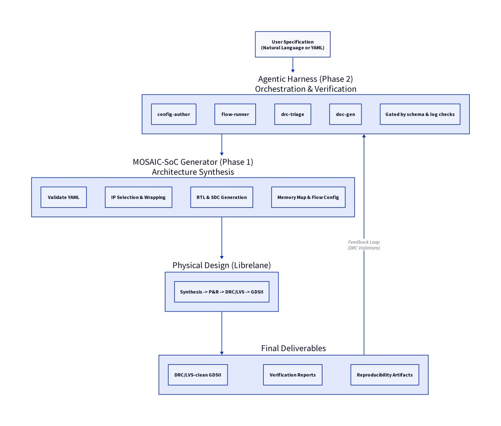

# MOSAIC-SoC

**Agent-Driven, Reconfigurable Multi-Core SoC Generator using Open-Source EDA**

> Describe a heterogeneous multi-core SoC in one config file.
> An LLM-driven harness assembles, synthesises, and verifies it , from RTL to tapeout-ready GDSII.
> Built for the IEEE SSCS Chipathon 2026: _Build It. Test It. Publish It._

---

## 1. Summary

MOSAIC-SoC is a configuration-driven **multi-core SoC generator** that turns a single high-level description into a synthesisable, tapeout-ready heterogeneous System-on-Chip, implemented entirely in open-source EDA. The open-source hardware community has long had individual RISC-V cores of every size , from the world's smallest (SERV, ~200 GE) to Linux-capable application processors (CVA6) , yet no openly available tool makes it straightforward to _compose_ these cores into a coherent multi-core system with shared memory, a bus fabric, and a scheduler. MOSAIC-SoC fills that gap.

On top of the generator we layer an **agentic harness** (Chipathon Track D): an LLM assistant equipped with hardware-specific skills that authors configurations, drives the RTL-to-GDSII flow, and triages DRC/LVS failures , reducing iteration time and lowering the barrier for newcomers to multi-core SoC design.

The headline deliverable is a **tapeout-ready heterogeneous multi-core SoC** generated from a single config, verified with open-source simulation, and submitted to the GF180MCU open PDK.

---

## 2. Motivation

### 2.1 The multi-core gap in open-source hardware

The open RISC-V ecosystem is rich in individual processor cores, but building a _multi-core_ SoC still requires manually: selecting and wrapping each core with a common bus interface, building the interconnect, sizing shared memory, writing a hardware-assisted scheduler, and then driving a complete RTL-to-GDSII flow, a process that takes weeks even for experienced designers. There is no open-source equivalent of what ARM's big.LITTLE and Cortex-M subsystem templates provided to proprietary SoC teams.

### 2.2 The heterogeneous efficiency opportunity

Not all tasks in an embedded system are equal. Sensor polling, signal processing, and OS scheduling span three decades of compute complexity. A single core architecture is always a compromise: either too powerful (wasting static power on lightweight tasks) or too limited (missing burst-compute deadlines). A _tiered_ approach , tiny cores for always-on sensing, little cores for signal conditioning, a big core for orchestration , can yield 4× or more energy savings at matched throughput, as the ARM big.LITTLE architecture demonstrated commercially.

MOSAIC-SoC makes this approach reproducible and accessible in fully open silicon.

### 2.3 The agentic opportunity (Track D)

Multi-core SoC generation involves many repetitive, error-prone artefacts: bus address maps, crossbar parameter files, memory bank configurations, synthesis constraints, and DRC/LVS debug loops. These are exactly the tasks where an LLM harness with well-scoped skills provides measurable value. The hypothesis we test: _does an agent-assisted workflow reduce iteration time and required expertise compared to a fully manual flow?_

---

## 3. Architecture

### 3.0 System Overview



### 3.1 Phase 1 : Multi-Core SoC Generator

A single declarative YAML config fully describes the SoC. The generator validates it, selects IP from the open-source library, elaborates parameterised RTL, and emits the Librelane flow configuration. The key contribution is that **any combination of cores from the catalogue** can be expressed in config , no RTL hand-editing required.

```yaml
# mosaic.yaml — illustrative PoC-α config
soc:
  name: mosaic_poc_alpha
  pdk: gf180mcu

  cores:
    - ip: ibex # big core — RV32IMC, 2-stage pipeline
      isa: rv32imc
      count: 1
      role: titan # orchestrator tier

    - ip: fazyrv # little cores — scalable 1/2/4/8-bit datapath
      isa: rv32i
      chunksize: 8 # configures FazyRV datapath width at synthesis
      count: 2
      role: atlas # signal-processing tier

    - ip: serv # tiny cores — bit-serial, ~200 GE each
      isa: rv32i
      count: 4
      role: nano # always-on sensor polling tier

  memory:
    sram_kb: 32 # banked; each bank independently clock-gated
    boot_rom_kb: 2

  bus: obi # Open Bus Interface — native to Ibex/X-HEEP ecosystem

  scheduler:
    tdu: true # Task Dispatch Unit: <100 GE hardware assist
    mode: dynamic # static | dynamic | power-aware

  peripherals:
    - uart
    - gpio
    - timer
    - spi
```

#### 3.1.1 Three-Tier Core Taxonomy

MOSAIC-SoC classifies every core in the library into one of three tiers. The generator uses this to wire the scheduler and set per-tier clock-gating strategies automatically.

| Tier | Label              | Gate-equivalent range | Typical IPC | Role                                 |
| ---- | ------------------ | --------------------- | ----------- | ------------------------------------ |
| T1   | **TITAN** (big)    | 25k – 500k GE         | 0.5 – 2.0   | RTOS / orchestration / burst compute |
| T2   | **ATLAS** (little) | 2k – 25k GE           | 0.1 – 0.5   | Signal conditioning / protocol tasks |
| T3   | **NANO** (tiny)    | < 2k GE               | 0.01 – 0.1  | Always-on sensor polling / crypto    |

#### 3.1.2 Standard Core Interface (SCI)

Every core from the catalogue is wrapped with a thin **Standard Core Interface** adaptor that presents an identical external view to the bus fabric regardless of the core's internal interface. The SCI exposes:

- **OBI 1.3** instruction + data ports (Harvard)
- `core_active_o` / `cpi_est_o[7:0]` , utilisation metrics consumed by the scheduler
- `sleep_req_i` / `wakeup_o` , clock-gate handshake driven by the Task Dispatch Unit
- Standard async-reset-with-sync-release, interrupt bus, and debug stub

Adding a new core to the catalogue means writing one SCI wrapper (~100–200 lines SV) and a FuseSoC `.core` descriptor , nothing else changes in the generator or fabric.

#### 3.1.3 Task Dispatch Unit (TDU)

The TDU is a < 100 GE memory-mapped hardware block that gives the software scheduler direct visibility into the cluster state without polling each core:

| Register         | Description                                                            |
| ---------------- | ---------------------------------------------------------------------- |
| `CORE_STATUS`    | Running / sleeping bitmask (one bit per core)                          |
| `CORE_CPI_EST`   | 8-bit CPI estimate per core (256-cycle sliding window)                 |
| `TASK_QUEUE`     | 8-deep FIFO , push a `{priority, tier, pc, arg_ptr}` entry to dispatch |
| `WAKE_MASK`      | Auto-wake a sleeping core when a matching task arrives                 |
| `ENERGY_COUNTER` | Per-core activity cycle count for power-aware scheduling               |
| `SCHED_MODE`     | `0` static / `1` dynamic load / `2` power-aware                        |

The TITAN core runs a FreeRTOS scheduler thread that reads `CORE_CPI_EST`, detects overloaded ATLAS cores, and migrates tasks. NANO cores never call the scheduler , their polling loops are fixed firmware; the TDU clock-gates them between sample events.

#### 3.1.4 Bus Fabric and Memory

The crossbar is a parameterised **OBI N×M crossbar** (from `pulp-platform/obi`), sized automatically by the generator from the core count. L1 SRAM is banked; each bank can be independently clock-gated or put into retention. A generated APB bridge connects low-speed peripherals.

### 3.2 Phase 2 , Agentic Harness

An LLM-driven harness with well-scoped, deterministically-checked skills:

| Skill           | What the agent does                                                  | How we verify it helped                       |
| --------------- | -------------------------------------------------------------------- | --------------------------------------------- |
| `config-author` | Translate natural-language intent into a valid `mosaic.yaml`         | Schema validation + diff vs. golden config    |
| `flow-runner`   | Invoke synthesis / P&R / signoff; parse and summarise logs           | Flow completion rate; time-to-first-clean-run |
| `drc-triage`    | Read DRC/LVS reports, propose targeted constraint or floorplan fixes | Violation count reduction per agent iteration |
| `doc-gen`       | Generate reproducible run reports and memory-map documentation       | Report completeness checklist                 |

> **Design principle:** the agent _assists and is checked by_ deterministic tooling. It never replaces signoff. Every agent action is gated by a schema validator or log parser before the flow proceeds.

### 3.3 Open-Source IP Library

All cores and peripherals are permissively licensed. The generator selects from:

**Cores:**

| Core                                                | Tier         | ISA           | Key property                                         |
| --------------------------------------------------- | ------------ | ------------- | ---------------------------------------------------- |
| [SERV](https://github.com/olofk/serv)               | NANO         | RV32I         | World's smallest RV core (~200 GE); bit-serial       |
| [FazyRV](https://github.com/meiniKi/FazyRV)         | NANO / ATLAS | RV32I         | Scalable 1/2/4/8-bit datapath at synthesis time      |
| [PicoRV32](https://github.com/YosysHQ/picorv32)     | ATLAS        | RV32IMC       | Simple, well-proven, fast bring-up                   |
| [Ibex / CVE2](https://github.com/lowrisc/ibex)      | TITAN        | RV32IMC       | Industrial-grade 2-stage; OBI-native; silicon-proven |
| [CV32E40P](https://github.com/openhwgroup/cv32e40p) | TITAN        | RV32IMFCXpulp | 4-stage; DSP extensions; PULP-proven                 |
| [CVA6](https://github.com/openhwgroup/cva6)         | TITAN        | RV64GC        | Linux-capable; stretch target                        |

**Buses:** OBI (primary), Wishbone (secondary); APB/AXI-Lite for peripherals.
**Peripherals:** UART, GPIO, timer, SPI, I2C (open-source RTL).
**Memory:** OpenRAM (GF180MCU) or flip-flop SRAM for bring-up.

---

## 4. Scope: MVP vs. Stretch Goals

Scoping is deliberate so there is always a demonstrable, tapeout-ready result.

### Proof of Concept (committed)

A **heterogeneous BIG.LITTLE SoC** in GF180MCU open PDK:

- 1× FazyRV-CHUNK8 (ATLAS) , parallel signal conditioning tasks
- 2× SERV (NANO) , always-on sensor polling
- External memory 32 KB for SRAM, 2 KB for boot ROM, UART + GPIO + timer
- Task Dispatch Unit (hardware scheduler assist)
- Full RTL-to-GDSII with **DRC and LVS clean**
- Area: 1.249 mm^2 in GF180MCU
- `config-author` + `flow-runner` agent skills working end-to-end
- One-command reproducibility: `make generate && make flow`

### Stretch Goals

- Generic _N×M_ multi-core generation (any combination of tiers, any core count)
- `drc-triage` skill: automated constraint adjustment from DRC feedback
- `doc-gen` skill: auto-generated memory map and run report
- Measurement study: agent-assisted vs. manual iteration effort (time, DRC rounds)
- CVA6 Linux-capable TITAN variant

---

## 5. Test It , Verification and Measurement Plan

### Functional verification

- RTL simulation (Verilator) of the full generated SoC running firmware that exercises all three tiers simultaneously: NANO cores polling virtual sensors, ATLAS cores running an IIR filter, TITAN core collecting results and transmitting over UART.
- RISC-V Architectural Tests pass on each wrapped core via the SCI interface.
- Inter-core communication through shared SRAM verified by directed test.

### Scheduler demonstration

Three simulation runs using the same firmware but different TDU `SCHED_MODE` settings demonstrate static, dynamic load-balancing, and power-aware dispatch. A synthetic workload spike (accelerometer sampling rate doubling for 3 seconds) shows task migration kicking in within 2 scheduler ticks (~10 ms at 50 MHz).

### Flow signoff

- DRC + LVS clean against GF180MCU PDK rule deck.
- STA timing closure at target clock (50 MHz nominal, conservative for this technology).
- Area report: estimated PoC die core area ≤ 1.5 mm² (dominated by SRAM; compute fabric < 0.3 mm²).

### Agent evaluation (Track D metrics)

| Metric                  | Measurement method                                                                             |
| ----------------------- | ---------------------------------------------------------------------------------------------- |
| Config validity rate    | Fraction of agent-generated `mosaic.yaml` files that pass schema validation without human edit |
| Flow success rate       | Fraction of agent-driven flow runs that complete without manual intervention                   |
| DRC iteration reduction | Violation count per round in agent-triaged vs. manual debug runs                               |
| Time-to-clean           | Wall-clock time from first run to DRC/LVS-clean result, agent-assisted vs. manual              |

### Reproducibility

Pinned tool versions (IIC-OSIC-TOOLS container), fixed random seeds, and a single `make` target that regenerates the full design from config and re-runs the flow. All results (area, timing, DRC counts) are checked into the repo.

---

## 6. Publish It , Dissemination Plan

- Public, documented, reproducible repository with example configs, simulation waveforms, and full flow run artefacts.
- Final report and presentation slides covering the heterogeneous multi-core architecture, generator design, agent skills, and quantitative evaluation results.
- Write-up of the agent-assisted-vs-manual measurement study as a standalone technical note.
- Optional: short paper submission to SSCS Code-a-Chip, ORConf 2026, or RISC-V Summit 2026.

---

## 7. Tools and Technology

| Category            | Tool / Source                                                               |
| ------------------- | --------------------------------------------------------------------------- |
| EDA flow            | [Librelane](https://github.com/efabless/librelane) (RTL-to-GDSII)           |
| PDK                 | GF180MCU (Chipathon open PDK)                                               |
| Environment         | IIC-OSIC-TOOLS container (pinned version, reproducible)                     |
| Synthesis           | Yosys + ABC (within Librelane)                                              |
| Place & Route       | OpenROAD (within Librelane)                                                 |
| Simulation          | Verilator 5.x + cocotb                                                      |
| IP management       | FuseSoC 2.x                                                                 |
| Bus fabric          | `pulp-platform/obi` OBI crossbar                                            |
| Agent stack         | LLM + tool-calling harness (Pi harness or OpenHands); exact runtime `[TBD]` |
| Formal verification | SymbiYosys + riscv-formal (per-core SCI wrapper check)                      |

---

## 8. Timeline (aligned to Chipathon phases)

| Phase       | Milestone                                                                                                                                                     |
| ----------- | ------------------------------------------------------------------------------------------------------------------------------------------------------------- |
| **Setup**   | IIC-OSIC-TOOLS environment confirmed; `mosaic.yaml` schema v0 finalised; SCI wrapper for SERV and FazyRV passing riscv-formal                                 |
| **Build**   | PoC-α RTL complete (7-core cluster); Verilator simulation passing all firmware tests; `config-author` + `flow-runner` skills operational; first Librelane run |
| **Review**  | DRC/LVS clean on PoC-α; TDU scheduler demonstration in simulation; interim design review submitted; `drc-triage` skill drafted                                |
| **Signoff** | Tapeout-ready GDSII; STA closure at 50 MHz; agent evaluation metrics collected; final report + slides + reproducibility package                               |

---

## 9. Risks and Mitigation

| Risk                                                   | Likelihood | Mitigation                                                                                                                                        |
| ------------------------------------------------------ | ---------- | ------------------------------------------------------------------------------------------------------------------------------------------------- |
| 7-core cluster too large for first tapeout slot        | Medium     | PoC can be split: 1 TITAN + 2 ATLAS first; NANO cores added in stretch phase. Generator architecture is the deliverable regardless of core count. |
| Agent hallucinates invalid config or flow steps        | Medium     | Every agent output gated by schema validation and log parsing; manual flow path always available as fallback                                      |
| GF180MCU SRAM macro unavailable at bring-up            | Low        | Use flip-flop SRAM for Phase 1; swap in OpenRAM macro once characterised                                                                          |
| OBI crossbar congestion at 7 cores                     | Low        | Conservative 50 MHz target; single shared L1 with banking keeps peak bandwidth manageable for the target workload                                 |
| FazyRV GF180MCU synthesis not previously characterised | Low        | FazyRV is technology-agnostic RTL; Yosys maps it cleanly; worst case fall back to PicoRV32 for ATLAS tier                                         |

---

## 10. Team

**Track:** D , AI/LLM for Circuits
**Team name:** MOSAIC-SoC

| Discord   | GitHub        | Affiliation              | Role                                                                                  |
| --------- | ------------- | ------------------------ | ------------------------------------------------------------------------------------- |
| MILOUDIAS | MILOUDIAS     | PhD Student / Researcher | Team Lead , RTL & SoC integration (Phase 1), EDA flow, physical design & verification |
| kewenlee  | trabdelbasset | PhD Student / Researcher | Agentic harness (Phase 2), EDA flow, physical design & verification                   |
| yassinehk | yacine-hk     | PhD Student / Researcher | RTL & SoC integration (Phase 1), EDA flow, physical design & verification             |

**Background:** Open-source EDA (Librelane, OpenROAD, Cocotb), SoC design (IHP SG13G2, GF180MCU), RISC-V cores, LLM agents.

---

## 11. Open Questions

- Confirm GF180MCU SRAM macro availability and characterisation status for the target process node.
- Define final agent harness pattern (single-agent + tools vs. multi-agent) and LLM runtime for Track D evaluation.
- Determine whether PoC-α submits as one hierarchical block or as individual hardened macros composed at the top level.

---

## References

- IEEE SSCS Chipathon 2026 , _Build It. Test It. Publish It._: <https://github.com/sscs-ose/sscs-chipathon-2026>
- SSCS PICO design contest: <https://sscs.ieee.org/technical-committees/tc-ose/sscs-pico-design-contest/>
- Participation guidelines: <https://github.com/sscs-ose/sscs-chipathon-2026/blob/main/docs/guidelines.md>
- X-HEEP (EPFL): <https://github.com/x-heep/x-heep>
- FazyRV: <https://github.com/meiniKi/FazyRV>
- SERV: <https://github.com/olofk/serv>
- Ibex / CVE2: <https://github.com/lowrisc/ibex>
- pulp-platform/obi (OBI bus): <https://github.com/pulp-platform/obi>
- Librelane: <https://github.com/efabless/librelane>
- IIC-OSIC-TOOLS: <https://github.com/iic-jku/iic-osic-tools>
