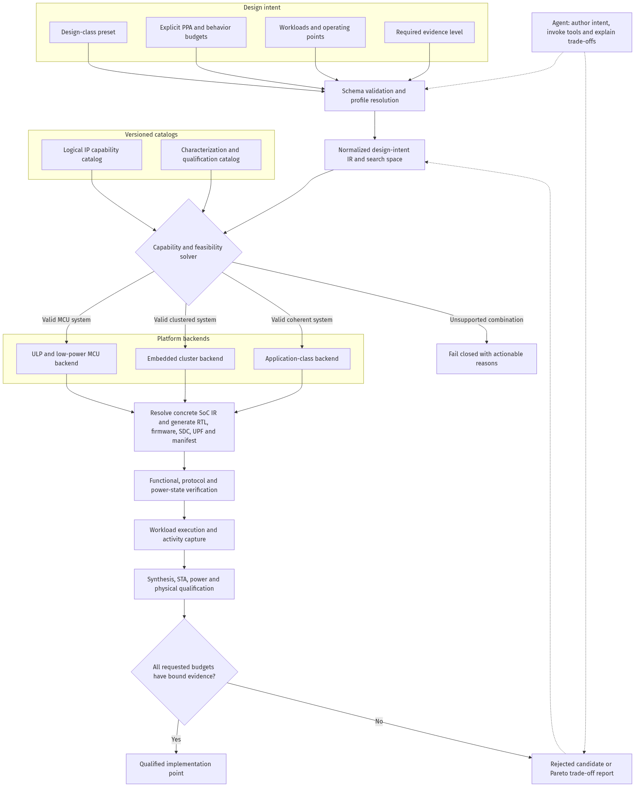

# Evolving MOSAIC-SoC into a General, Power-Targeted Multi-Core SoC Generator

> **Status:** Proposal for team review  
> **Date:** 2026-07-15  
> **Scope:** Generator architecture, configuration model, power intent, physical
> qualification, and the oh-my-soc harness  
> **Non-goal:** This document does not claim that the proposed backends, power
> domains, PPA models, or application-class platform are already implemented.

## Contents

- [Executive summary](#executive-summary)
- [Current repository assessment](#2-evidence-based-assessment-of-the-current-repository)
- [Product classes and measurable objectives](#3-separate-product-class-engineering-objective-and-evidence-maturity)
- [Compiler architecture and v2 configuration](#4-proposed-compiler-architecture)
- [Intent/resolved SoC IR and platform backends](#6-design-intent-and-resolved-soc-ir)
- [Accelerator boundary and catalogs](#8-keep-accelerators-separate-from-cpu-topology)
- [Power architecture](#11-power-architecture-evolution)
- [Harness qualification engine](#12-harness-evolution-from-flow-runner-to-qualification-engine)
- [Immediate correctness issues](#14-immediate-truth-and-correctness-issues)
- [Migration and phased roadmap](#15-backward-compatible-v1--v2-migration)
- [Risks, team decisions, and first work package](#18-risks-and-mitigations)

## Executive summary

MOSAIC-SoC is already a genuine heterogeneous multi-hart RTL generator. It can
select different cores, allocate hart IDs and bus masters, render RTL, generate
software collateral, and prove full-SoC all-hart liveness. The harness adds a
valuable fail-closed execution policy with typed tools, scope control, explicit
approval for physical work, and source/configuration freshness checks.

The current system is nevertheless best described as an **x-heep-derived MCU/AMP
generator**, not yet as a general SoC compiler. The public configuration remains
a flat list of CPU groups plus total SRAM, one bus, one scheduler, and a peripheral
list. It does not express measurable power or performance requirements, clock and
voltage domains, a memory hierarchy, coherence, external DRAM, workload context,
or a physical operating point. The current harness proves that a registered flow
ran successfully for current inputs; it does not yet prove that a design meets an
ultra-low-power, embedded, or application-class objective.

The recommended direction is to preserve the working generator as the first
backend while adding four layers above and around it:

1. A **versioned design-intent schema** that separates product class, explicit
   engineering budgets, and requested evidence maturity.
2. A backend-independent **normalized SoC intermediate representation (IR)** and
   resolved design lock shared by RTL, software, verification, documentation,
   timing, power intent, and physical flows.
3. A **capability, characterization, and qualification catalog** that distinguishes
   logical compatibility from estimated, measured, and physically qualified PPA.
4. A harness **evidence graph** that evaluates class-specific workloads and gates,
   rather than treating command exit status as an engineering result.

This document recommends three platform backends:

- `xheep_mcu_amp` for ULP and low-power MCU systems;
- `embedded_cluster` for richer deterministic or SMP/AMP embedded systems; and
- `coherent_application` for RV64/MMU/cache-coherent/DRAM/Linux systems.

Application class must be a distinct platform backend. It cannot be obtained
honestly by placing Rocket, BOOM, or CVA6 behind the current 32-bit OBI/SCI memory
system and retaining uncached shared-state windows.

The first implementation slice should not attempt all classes. It should:

1. correct current truth/measurement issues;
2. add the v2 schema and IR without changing generated RTL;
3. add typed PPA evidence to the harness; and
4. characterize one small ULP-oriented reference design end to end, promoting it
   to “qualified” only when the requested physical/signoff graph is complete.

## 1. What “general” should mean

“General generator” should not mean that every possible RISC-V core, PDK, NoC,
cache, or accelerator combination is automatically tapeout-ready. That standard is
neither realistic nor safe.

For MOSAIC, generality should mean:

- new component types and platform families can be added without rewriting the
  public schema;
- architectures are represented explicitly rather than hidden in Mako branches;
- unsupported component combinations are rejected before expensive EDA work;
- every automatic decision is recorded in a reproducible resolved design lock;
- different product classes have different mandatory evidence graphs;
- estimated, measured, and qualified results are never conflated; and
- a new PDK or platform point becomes supported only through a versioned,
  evidence-backed qualification entry.

The following vocabulary should be used consistently in documentation and reports:

| Term | Meaning |
|---|---|
| **Catalogued** | The component and its metadata are known to the generator. |
| **Integrated** | A backend can elaborate the component and its interface closure. |
| **Functionally verified** | The declared unit/full-SoC tests pass for an exact configuration. |
| **Characterized** | PPA metrics exist for a named implementation, PDK, voltage, corner, flow, and activity context. |
| **Physically qualified** | The required physical checks passed for the exact resolved design and implementation point. |
| **Signoff/tapeout qualified** | All declared signoff gates passed at all required corners with complete physical collateral. |

A simulation-only core can therefore be catalogued, integrated, and functionally
verified without being physically qualified. This is not a failure; it is precise
status reporting.

## 2. Evidence-based assessment of the current repository

### 2.1 What is already strong

The current system has several foundations worth preserving:

- `mosaic.yaml` drives heterogeneous CPU groups, counts, parameters, roles, hart
  IDs, and generated core instances.
- Per-hart instruction/data master indices and fabric sizing are generated.
- Software/linker/startup collateral and build manifests are topology-aware.
- Workers have a real per-hart clock-enable boundary and deterministic
  wake/park behavior
  ([`cpu_subsystem.sv.tpl`](../hw/core-v-mini-mcu/cpu_subsystem.sv.tpl#L219-L280)).
- SRAM banks already have independent clock/control boundaries.
- The current tapeout rule deliberately accepts only one exact configuration
  rather than implying that every syntactically valid YAML is physically ready
  ([`core_registry.py`](../util/xheep_gen/core_registry.py#L263-L296)).
- The harness hashes current configuration and source closure and enforces
  topology-check → RTL-generation → simulation prerequisites
  ([`agent.py`](../harness/agent.py#L475-L502),
  [`agent.py`](../harness/agent.py#L1714-L1736)).
- Existing functional regressions prove more than simple elaboration: the generic
  full-SoC flow requires configured harts to execute and report success.

The recommendation is to generalize these mechanisms, not replace them.

### 2.2 Main abstraction boundaries

| Boundary | Current evidence | Why it prevents broader platform generation |
|---|---|---|
| Flat topology schema | `MosaicConfig` contains CPU groups, scalar SRAM/ROM sizes, one bus, scheduler, and peripherals ([`mosaic_config.py`](../util/xheep_gen/mosaic_config.py#L51-L116)). | There is no cluster, cache, domain, external-memory, accelerator, or objective model. |
| Fixed base platform | The generator loads `configs/general.hjson` and overlays the MOSAIC topology ([`mosaic_config.py`](../util/xheep_gen/mosaic_config.py#L408-L445)). | Address infrastructure, AO services, interrupt catalog, DMA shape, and platform assumptions remain inherited. |
| MCU-specific global rules | Roles are TITAN/ATLAS/NANO, platform services are limited to 16 harts, and AMP requires one leading TITAN plus TDU ([`core_registry.py`](../util/xheep_gen/core_registry.py#L251-L260), [`core_registry.py`](../util/xheep_gen/core_registry.py#L755-L815)). | These are valid backend policies, but not universal multi-core rules. |
| Fixed CPU interface arithmetic | The backend assumes two 32-bit OBI masters per hart plus debug and fixed iDMA ports ([`xheep.py`](../util/xheep_gen/xheep.py#L223-L241)). | Unified ports, coherent ports, wider fabrics, QoS, CDC, and cluster-local networks are not first-class. |
| Aggregate CPU power domain | Multi-core sleep is reduced to `&core_sleep` before entering the inherited power manager ([`core_v_mini_mcu.sv.tpl`](../hw/core-v-mini-mcu/core_v_mini_mcu.sv.tpl#L578-L585)). | Per-hart/per-cluster switching, retention, and independently qualified operating states cannot be expressed. |
| Descriptive physical intent | UPF has one CPU domain and per-bank memory domains at a fixed supply, while LibreLane uses one supply pair and one 50 MHz clock ([`core-v-mini-mcu.upf.tpl`](../scripts/pnr/core-v-mini-mcu.upf.tpl#L13-L47), [`config.yaml`](../flow/librelane/config.yaml#L36-L49)). | A generated UPF file alone does not prove mapped switches, isolation, retention, multi-voltage PDN, or timing closure. |
| Topology-only prompt intent | `ParsedIntent` understands cores, memory, bus, scheduler, and peripherals ([`soc_from_prompt.py`](../harness/skills/soc_from_prompt.py#L77-L92)). | It cannot safely interpret frequency, power, energy, workload, OS, area, latency, or duty cycle. |
| Command-centric flows | `FlowRunner` is a static command registry and hardening is parsed like a test flow ([`flow_runner.py`](../harness/skills/flow_runner.py#L26-L138), [`flow_runner.py`](../harness/skills/flow_runner.py#L329-L368)). | Exit success is not a PPA or signoff verdict. |
| Simulation-only application cores | Current large-core wrappers deliberately use narrow/non-coherent integration techniques. | RV64 core liveness does not prove a coherent multi-core application platform. |

### 2.3 The current physical evidence boundary

The repository itself correctly states that it does not yet ship a bound physical
SoC source, qualified 32-KiB SRAM views, or a DRC/LVS-clean GDS
([`flow/librelane/README.md`](../flow/librelane/README.md#L26-L39)). Therefore:

- existing RTL/simulation success should remain celebrated and preserved;
- physical flow scaffolding should not be called physical qualification;
- power-class optimization should begin only after metrics can be extracted and
  compared consistently; and
- the canonical GF180 point should be completed and measured before broadening the
  physical matrix.

## 3. Separate product class, engineering objective, and evidence maturity

The terms “ultra-low-power”, “low power”, “embedded”, and “application class” are
useful presets, but they are not measurable specifications. Their meaning changes
with process, voltage, workload, duty cycle, package, memory, and system context.

The v2 schema should separate three orthogonal axes.

### 3.1 Design class

`design_class` selects defaults, required capabilities, and a required evidence
template. Initial classes could be:

- `ultra_low_power`
- `low_power_mcu`
- `embedded_rt`
- `application_linux`
- `custom`

### 3.2 Explicit objectives

Hard constraints must be unit-checked and bound to a context. Examples include:

- minimum clock frequency or throughput;
- maximum area;
- maximum active, idle, or sleep power;
- maximum energy per job/event/byte/inference;
- maximum wake latency or wake energy;
- deadline and interrupt-latency requirements;
- memory capacity and bandwidth;
- supported ambient/junction temperature and PVT corners; and
- workload and duty-cycle definition; and
- measurement scope, explicitly including or excluding logic, SRAM/macros, clock
  tree, pads, PLL/FLL, package, external PHYs, and powered-down leakage.

### 3.3 Evidence target

`evidence_target` states how mature the requested conclusion must be:

```text
rtl → functional → synthesized → physical → signoff
```

This must remain separate from product class. An `application_linux` design may
initially request functional FPGA evidence; an `ultra_low_power` design may request
post-route power evidence. Conversely, calling a design ULP does not make an RTL
estimate physically qualified.

Evidence targets should select a prefix of the class evidence graph. For example,
functional application-platform evidence may stop after boot and architectural
tests, while full application-class qualification additionally requires physical,
power, thermal, and signoff nodes. A successful graph prefix must be reported as
“functional evidence for an application-profile design,” not as a fully qualified
application-class implementation.

### 3.4 Merge and truth rules

Configuration resolution should follow this order:

```text
explicit user constraints
→ design-class defaults
→ feasible-backend discovery
→ per-backend candidate defaults and resolution
```

Within a resolved backend candidate, precedence remains:

```text
explicit user value > design-class default > backend default
```

Backend defaults must not be applied before a backend is found feasible, and they
must never override an explicit requirement. The resolved lock must record the
source of every value. Missing measurements are `UNKNOWN`, never zero. `UNKNOWN`
cannot satisfy a maximum or minimum constraint.

## 4. Proposed compiler architecture



The editable Mermaid source is
[`general_multicore_soc_generator.mmd`](source/images/general_multicore_soc_generator.mmd);
a scalable
[`SVG export`](source/images/general_multicore_soc_generator.svg) is also included.

The key architectural rule is that raw YAML stops at the front end. Intent analysis
and DSE should consume a canonical `DesignIntentIR`; RTL templates, software
generators, topology checks, SDC/UPF generation, documentation, and qualification
should consume a fully concrete `ResolvedSoCIR` and resolved design lock. None of
these consumers should independently reinterpret the YAML.

### 4.1 Compiler stages

1. **Schema parse and migration**
   - Recognize v1 and v2 inputs.
   - Reject unknown unnamespaced fields.
   - Normalize units and enumerations.
2. **Profile expansion**
   - Apply design-class defaults only.
   - Record where every derived value came from.
3. **Normalized design-intent IR**
   - Represent fixed requirements, allowed choices/ranges, components, domains,
     address spaces, and connections with stable IDs.
4. **Capability and feasibility solving**
   - Discover feasible backends, apply candidate-specific defaults, enumerate legal
     candidates, and check protocol, width, ISA, privilege, memory, power, software,
     and physical requirements before rendering.
5. **Concrete resolved SoC IR and design lock**
   - Record selected component versions, parameters, derived addresses, hart IDs,
     clocks, domains, macros, bridges, assumptions, and catalog records.
6. **Backend lowering**
   - Generate RTL, software, verification collateral, build descriptions, SDC,
     UPF, and physical configuration.
7. **Evidence graph construction**
   - Derive mandatory verification and measurement nodes from the design class,
     objectives, backend, and requested evidence target.
8. **Qualification or trade-off report**
   - Return either a passing computed qualification result, a structured unsupported
     result, or an evidence-backed Pareto frontier.

## 5. Proposed v2 configuration

The following is an illustrative schema, not a commitment to exact field names or
power values:

```yaml
schema_version: 2

soc:
  name: sensor_controller
  design_class: ultra_low_power

objectives:
  workload: sensor_poll_v1
  frequency_mhz: {min: 10}
  area_mm2: {max: 0.50}
  sleep_power_uw: {max: 5}
  wake_latency_us: {max: 100}
  energy_per_job_uj: {max: 2}
  measurement_scope:
    included: [core_logic, sram, clock_tree]
    excluded: [pads, package, external_phy]

compute:
  clusters:
    - id: controller
      core:
        ip: cv32e20
        isa: rv32emc
        count: 1
      execution_model: amp_controller
      clock_domain: controller_clk
      power_domain: controller_pd

    - id: workers
      core:
        ip: serv
        isa: rv32i
        count: 4
      execution_model: amp_workers
      clock_domain: worker_clk
      power_domain: worker_pd
      reset_vector: 0x2000

accelerators: []

memory:
  regions:
    - id: retained_sram
      kind: sram
      capacity_kib: 8
      banks: auto
      retention: required
      power_domain: retained_mem_pd

interconnects:
  - id: system_bus
    kind: obi
    data_width_bits: 32

clocks:
  - id: aon_clk
    frequency_mhz: 1
  - id: controller_clk
    frequency_mhz: 10
    gateable: true
  - id: worker_clk
    frequency_mhz: 10
    gateable: true

power:
  domains:
    - id: always_on
      always_on: true
    - id: controller_pd
      switchable: true
      isolation: required
      retention: none
    - id: worker_pd
      switchable: true
      isolation: required
      retention: none
    - id: retained_mem_pd
      switchable: true
      isolation: required
      retention: required

services:
  wake_controller:
    kind: tdu_wake
    clock_domain: aon_clk
    power_domain: always_on
  scheduler:
    kind: tdu
    mode: power_aware

software:
  environment: bare_metal

implementation:
  backend: auto
  pdk: gf180mcu
  evidence_target: synthesized
  corners: [tt_25c]
```

Important schema rules:

- internal units should be canonical even if user-facing aliases are accepted;
- every object should have a stable ID;
- connections should reference IDs, not array positions;
- address ranges should use one half-open convention `[base, end)`;
- auto-selected values must appear explicitly in the resolved lock;
- unknown or unsupported properties must fail closed when required; and
- backend extensions should be namespaced rather than becoming global schema fields.

## 6. Design-intent and resolved SoC IR

Do not use one type for both unresolved choices and a renderable architecture.
Design-space exploration needs ranges and alternatives; generators need a fully
concrete graph. A possible split is:

```python
@dataclass(frozen=True)
class DesignIntentIR:
    schema_version: int
    identity: SoCIdentity
    objectives: ObjectiveSet
    requested_architecture: ArchitectureIntent
    search_space: ChoiceSpace
    implementation_request: ImplementationRequest


@dataclass(frozen=True)
class ResolvedSoCIR:
    schema_version: int
    identity: SoCIdentity
    objectives: ObjectiveSet
    compute_clusters: tuple[ComputeClusterIR, ...]
    accelerators: tuple[AcceleratorIR, ...]
    memories: tuple[MemoryIR, ...]
    interconnects: tuple[InterconnectIR, ...]
    address_spaces: tuple[AddressSpaceIR, ...]
    clocks: tuple[ClockDomainIR, ...]
    resets: tuple[ResetDomainIR, ...]
    power_domains: tuple[PowerDomainIR, ...]
    devices: tuple[DeviceIR, ...]
    io: IoSubsystemIR
    pad_ring: PadRingIR | ExternalBoundaryIR
    clock_sources: tuple[ClockSourceIR, ...]
    supplies: tuple[SupplyIR, ...]
    package: PackageIR | ExternalBoundaryIR
    external_interfaces: tuple[ExternalInterfaceIR, ...]
    platform_services: PlatformServicesIR
    software: SoftwareIR
    implementation: ImplementationIR
```

`ChoiceSpace` should type every legal search variable—for example allowed core
implementations/counts, memory sizes and bank counts, frequency points, retained
banks, interconnect choices, and domain partitions. Candidate enumeration produces
immutable `ResolvedSoCIR` instances; only those instances may enter backend lowering
or evidence generation.

Pads, pinmux, package, PLL/FLL/clock sources, supplies/regulators, and external PHYs
must either be represented in the resolved IR or declared as explicit external
inputs. Qualification cannot cover a boundary whose implementation and evidence are
not bound to the design lock.

### 6.1 Compute clusters

Each cluster should specify:

- core implementation and immutable source provenance;
- count and hart-ID allocation policy;
- ISA, XLEN, ABI, and privilege modes;
- AMP or SMP execution model;
- local memories and caches;
- MMU/PMP and atomic/LR-SC capabilities;
- interrupt and debug attachments;
- clock, reset, power, and coherence domains;
- reset vector and boot image; and
- software environment and required toolchain.

The current `CpuConfig` remains a useful lowering type for `xheep_mcu_amp`; it
should not become the backend-independent IR.

### 6.2 Memory resources

Model memory as addressable resources rather than only total KiB:

- ROM, SRAM, retained SRAM, TCM/TCDM, scratchpad, cache, and external DRAM;
- capacity, width, banks, ports, latency, and sustainable bandwidth;
- ECC/parity and interleaving;
- cacheability, shareability, and permitted initiators;
- clock and power domain;
- retention states and wake cost; and
- physical macro requirements and legal PDKs.

The current automatic split into at most 32-KiB banks can remain an `auto` policy
of the MCU backend, but its resolved result must be explicit.

### 6.3 Interconnects

Interconnect IR should include:

- protocol and address/data widths;
- manager and subordinate endpoint descriptions;
- ordering and outstanding-transaction requirements;
- atomics and coherence behavior;
- arbitration and QoS;
- topology and routing;
- clock-domain crossings and width/protocol bridges;
- address translation; and
- guaranteed and peak bandwidth.

The existing OBI, LOG, and compact FlooNoC modes become implementations in the MCU
backend. Current LOG banking and compact single-router FlooNoC restrictions should
be backend capability rules, not global properties of MOSAIC.

### 6.4 Clock, reset, and power domains

Power intent should express:

- always-on and switchable domains;
- supplies, voltage, and legal power states;
- parent/child sequencing;
- isolation strategy and clamp values;
- retained state and retention-capable memories/cells;
- switch control and acknowledgement;
- wake sources and maximum wake latency; and
- membership of every generated component.

Clock intent should express source, frequency/range, gating, and operating points.
Reset intent should express assertion/deassertion domains and synchronization.

The same resolved domain graph must generate:

- RTL control and acknowledgement ports;
- power-manager registers and firmware tables;
- UPF;
- SDC including `create_generated_clock` and clock groups;
- CDC/RDC expectations;
- topology diagrams; and
- verification sequences for legal and illegal transitions.

## 7. Platform backend separation

Backends should implement a small common protocol:

```python
class SoCBackend(Protocol):
    def capability_findings(self, intent: DesignIntentIR) -> list[Finding]: ...
    def resolve_candidates(
        self, intent: DesignIntentIR, catalog: Catalog
    ) -> Iterable[ResolvedSoCIR]: ...
    def lower(self, resolved: ResolvedSoCIR) -> ArtifactSet: ...
    def required_evidence(self, resolved: ResolvedSoCIR) -> EvidenceGraph: ...
```

### 7.1 `xheep_mcu_amp`

This backend should preserve the current working platform:

- SCI/native MCU and serial cores;
- OBI, LOG, and current compact FlooNoC modes;
- banked SRAM and boot ROM;
- iDMA, TDU, and existing peripherals;
- bare-metal/RTOS-oriented AMP and supported all-TITAN SMP; and
- initially single-voltage physical implementation.

It is the natural home for ULP and low-power MCU profiles, provided power domains,
retention, clocks, and measurements are made explicit.

### 7.2 `embedded_cluster`

This backend should add architecture that is difficult to express cleanly through
the current flat hart list:

- reusable clusters with local TCM/TCDM or scratchpad;
- hierarchical interconnect;
- deterministic arbitration or QoS;
- cluster DMA and wider data paths;
- optional SMP atomics and a formal memory-ordering contract;
- per-cluster clock/power domains; and
- RTOS/real-time workload support.

### 7.3 `coherent_application`

A real multi-core application backend requires:

- RV64 and required privileged architecture;
- MMU/PMP and boot privilege transitions;
- coherent L1/L2 hierarchy for SMP;
- AMOs and LR/SC through the complete memory path;
- external DRAM and its controller/PHY integration boundary;
- scalable timer and interrupt architecture;
- multiple clock/reset domains;
- OpenSBI/Linux or the selected OS boot path; and
- coherence, bandwidth, OS, thermal, IR, and physical verification.

The current CVA6, Rocket, and BOOM integrations remain valuable simulation work,
but they must not satisfy this backend's capability gate until the memory-system and
software requirements exist end to end.

## 8. Keep accelerators separate from CPU topology

An accelerator should be represented under `accelerators[]`, not automatically
under `compute.clusters[]`. It is not necessarily:

- an OS-visible hart;
- assigned a `hart_id`;
- a PLIC target;
- a TDU worker; or
- a participant in CPU cache coherence.

A recommended accelerator contract is:

```yaml
accelerators:
  - id: npu0
    ip: coral_npu
    control:
      protocol: obi
      data_width_bits: 32
      address_region: npu0_regs
    data:
      protocol: axi4
      data_width_bits: 256
      address_spaces: [shared_l2]
      coherent: false
    interrupts: [completion, error]
    local_memory: npu0_scratchpad
    clock_domain: npu_clk
    power_domain: npu_pd
    software:
      descriptor_abi: npu_queue_v1
```

The preferred boundary has separate planes:

1. narrow MMIO control/status/doorbell/interrupt plane;
2. wide DMA or manager data plane into shared SRAM/L2/DRAM;
3. reset, boot, fault, and ownership plane; and
4. an explicit non-coherent cache-maintenance or coherent attachment policy.

This prevents a large accelerator's bandwidth from being forced through a narrow
host control bus and keeps CPU scheduling semantics distinct from accelerator
queue/ownership semantics.

## 9. Capability, characterization, and qualification catalogs

One large `CoreSpec` containing every logical and physical property would become
difficult to maintain. Use three related record types.

### 9.1 Logical component catalog

Logical records describe immutable functionality and integration:

```yaml
id: core.serv
kind: cpu
source:
  repository: upstream-url
  commit: exact-commit
  license: ISC
interfaces:
  instruction: {protocol: wishbone, width_bits: 32}
  data: {protocol: wishbone, width_bits: 32}
provides:
  xlen: 32
  privilege: [m]
  atomics: false
  mmu: false
power_states: [running, clock_gated]
integration:
  wrapper: serv_sci
  backends: [xheep_mcu_amp]
required_evidence_kinds:
  - rtl_lint
  - wrapper_tb
  - full_soc_liveness
```

Extend beyond today's ISA/parameters/`sim_only`/capability strings
([`core_registry.py`](../util/xheep_gen/core_registry.py#L56-L65)) to include
interface semantics, privilege, atomics, ordering, coherence, debug, software, and
power-state requirements. Mutable PASS/FAIL results belong in immutable evidence
records referenced by a qualification result, not in the logical component entry.

### 9.2 Characterization records

PPA data should be immutable measurement records keyed by:

```text
component commit and parameters
+ wrapper/backend version
+ PDK and library revisions
+ voltage and PVT corner
+ synthesis/physical recipe and constraints
+ workload and activity source
+ tool/container versions
```

Metrics may include area, fmax/slack, leakage, dynamic power, energy/job, wake
latency/energy, memory access/retention energy, congestion, and IR drop. Each metric
must include units, source report, fidelity, confidence, and artifact hashes.

It is invalid to compare a SERV post-route GF180 result and a BOOM generic RTL
estimate as though they had equal fidelity. Estimates can guide exploration, but
they must carry uncertainty and cannot satisfy a qualified physical target.

### 9.3 Qualification records

A qualification **specification** binds an exact resolved design and implementation
point to required evidence:

```yaml
qualification_spec_id: gf180_mosaic_poc_v1
backend: xheep_mcu_amp
resolved_design_sha256: ...
pdk_revision: ...
required_evidence:
  - functional_all_hart
  - synthesis_area
  - sta_required_corners
  - power_required_workloads
  - drc
  - lvs
```

A separate computed qualification result references this specification and immutable
evidence IDs, then derives `PASS`, `FAIL`, `UNKNOWN`, or `INCOMPLETE`. The current
canonical tapeout tuple is an early hardcoded **physical-candidate requirement**, not
a qualified result—the repository explicitly lacks its complete physical evidence.
Move it into versioned data only after the new path preserves that fail-closed
behavior.

## 10. Generator invariants

Validation should be layered and produce structured findings with stable codes,
paths, requirements, and suggested corrections.

```json
{
  "code": "POWER_ISOLATION_REQUIRED",
  "severity": "error",
  "path": "power.domains.worker_pd",
  "message": "Switchable domain drives always_on without isolation",
  "suggestions": ["set isolation: required", "move the consumer"]
}
```

### 10.1 Common invariants

- IDs are unique and all references resolve.
- Units and dimensions are valid.
- Address regions do not overlap unless an explicit alias is declared.
- Reset vectors point into executable memory.
- Images fit their regions and use compatible ISA/ABI.
- Every component belongs to one clock, reset, and power domain.
- Every protocol/width crossing has a registered bridge.
- Every switchable-domain output entering an active domain has isolation.
- Retained state maps to retention-capable cells or macros.
- Wake control resides in a domain that remains active.
- Requested software services are supported by the architecture.
- A required metric with `UNKNOWN` status cannot pass a constraint.

### 10.2 Backend-specific invariants

The following current restrictions should move out of the universal schema:

- 16-hart service limit;
- exactly one leading TITAN in an AMP topology;
- mandatory TDU worker wake policy;
- current LOG bank-count rules;
- compact FlooNoC topology; and
- two 32-bit OBI ports per hart.

They remain valid constraints of the first backend until that backend changes.

## 11. Power architecture evolution

### 11.1 What exists today

- per-hart clock gates;
- aggregate CPU power switch/isolation/reset sequencing;
- peripheral controls;
- per-bank SRAM controls;
- UPF descriptions of aggregate CPU, peripheral, and bank domains; and
- a 50 MHz single-clock physical constraint.

This is useful low-power scaffolding, but not independent per-hart power switching
or DVFS. The CPU power manager's retention output is currently marked unused
([`power_manager.sv.tpl`](../hw/ip/power_manager/rtl/power_manager.sv.tpl#L121-L138)).

### 11.2 Required evolution

For ULP and low-power qualification, the generator should resolve and generate:

- an always-on wake/control island;
- per-hart or per-cluster switchable domains;
- memory retention selection;
- isolation and clamp strategy;
- legal power-state sequences and acknowledgements;
- configurable clocks and supported operating points;
- generated-clock and CDC/RDC constraints;
- qualified PDK clock-gating/power/isolation/retention cells;
- scan/test enables for clock gates; and
- firmware-visible state and transition tables.

If the selected open-source flow cannot physically implement multi-voltage UPF,
MOSAIC should fail closed or qualify only single-voltage clock-gated variants. A
descriptive UPF artifact must never be reported as completed power intent.

Power evidence should distinguish three levels:

1. **Behavioral protocol evidence:** RTL sequencing, quiescence, isolation control,
   reset, retention intent, and wake behavior are functionally correct.
2. **Power-aware implementation evidence:** a power-aware simulator or equivalent
   model shows corruption, clamp, retention, and legal transition semantics using
   the resolved intent.
3. **Mapped physical evidence:** qualified isolation/retention/switch cells or
   macros, PDN, post-route timing, and leakage/power reports prove implementation.

Passing the first level cannot satisfy a physical power-gating claim. If the first
GF180 reference is clock-gated only, both its profile and reports must say so.

### 11.3 Memory compiler/catalog

Replace size-only RAM selection with a catalog containing:

- exact bit/byte capacity;
- width, depth, port count, mask granularity, and latency;
- voltage and legal corners;
- leakage, access energy, and wake/retention behavior;
- aspect ratio and physical size;
- GDS/LEF/LIB/SPICE/RTL view hashes; and
- legal PDK/backend combinations.

A deterministic solver can then select banks and interleaving from capacity,
bandwidth, leakage, active energy, area, and wake constraints.

## 12. Harness evolution: from flow runner to qualification engine

### 12.1 Preserve the current safety foundation

The following mechanisms should remain non-negotiable:

- typed registered tools and rejection of arbitrary operations;
- user-derived non-escalatable scope ceilings;
- explicit approval for physical and integration actions;
- secret removal at the subprocess boundary;
- process-group timeout cleanup;
- private append-only journals; and
- configuration and complete source-closure freshness checks.

These guarantees are uniform only at the in-process `api`/`deterministic` policy
boundary. External Claude and omp drivers hand off to interactive TTYs and use their
native permission systems
([`harness/README.md`](../harness/README.md#L88-L106)). Their integration must be
documented and tested separately rather than assuming that Python approval flags or
JSONL policy apply to them.

Every future `FlowSpec` must declare its effect class, execution cost, required
scope, and approval requirement explicitly. There must be no permissive default:
today only two named hardening flows receive special physical treatment
([`agent_tools.py`](../harness/agent_tools.py#L302-L320)), so adding power, IR,
signoff, or DSE commands without typed effect metadata could otherwise inherit an
incorrect lower-authority flow policy.

The model remains a planner and explainer. Deterministic tooling remains the
authority for compatibility, measurements, constraint evaluation, and Pareto
dominance.

### 12.2 Typed evidence graph

Replace special-purpose flags such as one `physical_ok` boolean
([`agent.py`](../harness/agent.py#L793-L799)) with immutable evidence references and
a required graph generated from:

```text
resolved SoC IR and design lock
+ design class
+ explicit objectives
+ selected backend
+ requested evidence target
```

Representative universal chain:

```text
schema-valid intent
→ normalized DesignIntentIR
→ capability decision
→ concrete ResolvedSoCIR and design lock
→ generated RTL/software/constraints
→ lint and unit protocol checks
→ full-SoC functional test
→ profile workload
→ activity capture
→ synthesis, STA, and area
→ activity-backed power
→ placement and routing
→ post-route timing and power
→ DRC/LVS/antenna/IR checks
→ profile qualification verdict
```

Evidence states should include at least:

- `PASS`
- `FAIL`
- `UNKNOWN`
- `UNSUPPORTED`
- `NOT_APPLICABLE`
- `INFRASTRUCTURE_ERROR`

Their semantics must be exact:

- `UNKNOWN`: the node has not run or an upstream prerequisite has no evidence;
- `UNSUPPORTED`: deterministic capability analysis proves the requested operation
  cannot be implemented by the selected backend/tool/PDK;
- `INFRASTRUCTURE_ERROR`: an executed stage did not produce a mandatory report or
  the report could not be parsed/validated;
- `FAIL`: the stage executed validly but a functional or engineering threshold was
  violated;
- `NOT_APPLICABLE`: deterministic graph construction proves the node is irrelevant;
  and
- `PASS`: the node executed, all mandatory reports are valid, and every required
  threshold passed.

Only `PASS` may close a required graph node. `NOT_APPLICABLE` removes a node during
deterministic graph construction; the model cannot assign it. A qualification
result is `INCOMPLETE` while required nodes remain `UNKNOWN` or have not run. An
exit code is execution evidence, not qualification evidence.

### 12.3 Evidence record

Each evidence node should emit immutable structured data similar to:

```json
{
  "schema_version": 1,
  "evidence_id": "sha256:...",
  "kind": "power.post_synthesis",
  "status": "PASS",
  "subject": {
    "build_key": "sensor-node-1a2b3c4d5e6f",
    "resolved_ir_sha256": "...",
    "design_lock_sha256": "...",
    "source_closure_sha256": "...",
    "config_sha256": "...",
    "sdc_sha256": "...",
    "upf_sha256": "..."
  },
  "producer": {
    "flow": "power-post-synth",
    "flow_version": 1,
    "flow_spec_sha256": "...",
    "parser_sha256": "...",
    "tool": "selected-power-engine",
    "tool_version": "...",
    "environment_sha256": "..."
  },
  "context": {
    "backend": "xheep_mcu_amp",
    "pdk": "gf180mcu",
    "pdk_revision": "...",
    "standard_cell_library_sha256": "...",
    "macro_view_set_sha256": "...",
    "corner": "tt_1v8_25c",
    "voltage_v": 1.8,
    "workload_id": "sensor_poll_v1",
    "workload_sha256": "...",
    "dataset_sha256": "...",
    "firmware_sha256": "...",
    "roi_definition_sha256": "...",
    "activity_sha256": "...",
    "seed": 1,
    "measurement_scope": {
      "included": ["core_logic", "sram", "clock_tree"],
      "excluded": ["pads", "package", "external_phy"]
    }
  },
  "inputs": [
    {"kind": "netlist", "path": "inputs/soc.v", "sha256": "..."},
    {"kind": "activity", "path": "inputs/roi.saif", "sha256": "..."}
  ],
  "metrics": [
    {
      "name": "energy_per_job",
      "value": 2.17,
      "unit": "uJ",
      "quality": "post_synthesis_estimate",
      "source_artifact": "reports/power.rpt",
      "source_artifact_sha256": "..."
    }
  ],
  "requirements": [
    {
      "metric": "energy_per_job",
      "operator": "<=",
      "limit": 5.0,
      "unit": "uJ",
      "result": "PASS"
    }
  ],
  "artifacts": [
    {"kind": "power_report", "path": "reports/power.rpt", "sha256": "..."}
  ],
  "started_utc": "...",
  "finished_utc": "..."
}
```

Every timing/power metric must name voltage and corner. Every workload-dependent
metric must bind workload, firmware, inputs, measurement region, and activity.
Power objectives and evidence must also define their measurement boundary: core
logic, SRAM/macros, clock tree, pads, PLLs, package, external PHYs, and powered-down
domain leakage must be explicitly included or excluded.

### 12.4 Workload contract and activity capture

Liveness remains a mandatory infrastructure gate, but it is not a PPA workload.
Every reference workload should define:

- source and input-data revisions;
- firmware binary hash;
- expected functional result;
- reset and initial power state;
- warm-up phase;
- explicit region-of-interest start/end markers;
- iteration count and random seed;
- clock/voltage operating point;
- expected peripherals, DMA, and memory regions; and
- trace coverage requirements.

The lifecycle should be:

```text
reset → boot → warm-up → ROI_START → measured execution
      → ROI_END → quiesce → validate result
```

For sleep workloads:

```text
job → sleep entry → bus/clock quiescence → retained interval
    → wake event → restoration check → next job
```

Power evidence is invalid if the workload oracle fails, ROI markers are incomplete,
activity coverage is below the declared threshold, the dataset/firmware changed, or
simulator/tool provenance is missing—even when the power tool exits successfully.
VCD/FST/SAIF must be hashed as measurement evidence, not treated as generator
source.

### 12.5 Physical-flow truthfulness

Create dedicated parsers for:

- cell/macro/core/die area;
- WNS/TNS and achieved frequency for every clock;
- unconstrained endpoints;
- dynamic and leakage power by hierarchy/domain;
- congestion and routing overflow;
- DRC, LVS, and antenna results;
- post-route timing at required corners;
- IR drop and EM for every qualification specification that requires them; and
- GDS/netlist/LEF/report hashes.

An exit-zero flow with negative required slack, a non-waived DRC violation, or an
LVS mismatch must be `FAIL`. Every mandatory clock and corner must report WNS, TNS,
and unconstrained endpoints. Area and power must be compared with the declared
objective and measurement scope. DRC/antenna waiver-set identity must be bound to
the result. An unexecuted flow is `UNKNOWN`; an executed flow with a missing or
unparseable mandatory report is `INFRASTRUCTURE_ERROR`. If required IR/EM or another
signoff capability is unavailable, the qualification request is `UNSUPPORTED`, not
silently reduced.

### 12.6 Multi-fidelity design-space exploration

The explorer should deterministically enumerate concrete `ResolvedSoCIR` candidates
from the typed `DesignIntentIR.search_space`, then use a bounded funnel:

1. capability filtering;
2. analytical characterization-based estimates;
3. synthesis and STA;
4. workload/activity power;
5. physical exploration of only the top `K` candidates; and
6. full qualification of the selected candidate.

Hard constraints are applied before ranking, but low-fidelity estimates must be
uncertainty-aware. Reject a candidate early only when its full credible interval
violates a constraint; otherwise mark it uncertain and promote it to a higher-
fidelity stage. Among feasible candidates, report the nondominated Pareto frontier.
Keep rejected, failed, and timed-out candidates with their reasons. Do not hide
trade-offs behind a weighted score unless the user has provided weights or selected
a named policy.

Exploration requires an explicit resource budget:

```yaml
max_candidates: 64
max_synthesis_runs: 16
max_physical_runs: 0
max_parallel_jobs: 4
max_wall_time_minutes: 480
max_disk_gb: 100
allowed_evidence_level: post_synthesis
```

The agent must not widen this budget. Candidate artifacts should remain in
`build/explore/`; promoting a result into maintained `configs/` is a separate
explicit write.

Budget enforcement must be deterministic across candidate count, synthesis and
physical run count, wall time, disk, concurrency, cancellation, and descendant
process cleanup. `max_physical_runs` must be zero when the allowed evidence level is
post-synthesis; permitting physical evidence requires a matching authority scope
and budget.

### 12.7 Content-addressed cache and invalidation

An evidence cache key must include:

```text
normalized design intent + resolved SoC IR + design lock
+ FlowSpec and parser code identities
+ tool and container/Nix-lock identity
+ PDK, standard-cell, macro, and extraction-view hashes
+ SDC, UPF, clock, reset, and power plans
+ workload, dataset, firmware, ROI, and activity policy/trace
+ PVT corner, seed, and relevant tool options
```

The evidence key must include harness flow/parser code explicitly rather than
assuming the generator source hash covers it. A parser or `FlowSpec` change must
invalidate dependent evidence. Successful evidence directories should be immutable
and atomically written; cache hits require every declared input hash to match.

## 13. Required evidence by design class

The table below defines the full **physical/signoff qualification** graph for each
class. Lower evidence targets execute only the appropriate prefix and must report
that narrower maturity explicitly.

| Class | Architecture expectations | Full physical/signoff qualification evidence |
|---|---|---|
| **Ultra-low-power** | AON wake island, switchable workers, retained state, minimal memories/peripherals | Bus/clock quiescence, isolation sequence, retained-state correctness, sleep leakage, wake time/energy, duty-cycle energy/event, wake-current IR drop |
| **Low-power MCU** | Per-hart/cluster clock or power gating, bank gating, optional operating points, DMA offload | Active/idle/sleep power, energy/task, DMA-vs-CPU comparison, peripheral wake, SRAM retention, operating-point timing/power |
| **Embedded/real-time** | Deterministic memory/fabric, larger SRAM/TCM, RTOS, optional SMP | RTOS boot, interrupt latency, deadlines/WCET-oriented workload, contention stress, memory fit, all-clock STA, peak power and area |
| **Application/Linux** | RV64, MMU, coherent caches, atomics, DRAM, scalable interrupts/timers | OpenSBI/Linux boot, SMP/coherence litmus, DRAM tests, bandwidth, sustained performance/W, thermal, IR/EM, complete physical evidence |

An application-class request should return `UNSUPPORTED` today with a list of missing
capabilities. A sentinel write from an RV64 core is not equivalent to SMP coherence
or OS support.

## 14. Immediate truth and correctness issues

These should be resolved before using MOSAIC for power-target optimization.

### 14.1 OpenRAM capacity labels

- `mosaic_sram_32k.py` specifies `4096 × 8` bits, which is 4096 bytes = 4 KiB,
  not 32 KiB
  ([`mosaic_sram_32k.py`](../sw/vendor/openram/configs/mosaic_sram_32k.py#L21-L24)).
- `mosaic_sram_4k.py` specifies `512 × 8` bits, which is 512 bytes, not 4 KiB
  ([`mosaic_sram_4k.py`](../sw/vendor/openram/configs/mosaic_sram_4k.py#L18-L21)).

The configs, names, documentation, and any physical-bundle capacity checks need one
consistent definition before SRAM area/power optimization.

### 14.2 TDU energy terminology and overflow

The TDU increments its counter by the number of active harts each cycle, weighting a
SERV and a BOOM hart equally. This is **active-hart-cycles**, not energy
([`tdu.sv`](../hw/tdu/rtl/tdu.sv#L271-L287)). The comment says the counter saturates,
but the implementation performs ordinary 32-bit addition and can wrap.

Either:

- rename the register/API/reporting to `ACTIVE_HART_CYCLES` and fix/document
  overflow semantics; or
- implement characterized per-core/per-state weights, while still treating the
  result as an estimate rather than physical joules.

### 14.3 Physical PASS semantics

The harness sets `physical_ok` after a successful registered physical flow and later
checks freshness, but not timing, area, power, DRC, or LVS thresholds
([`agent.py`](../harness/agent.py#L793-L799),
[`agent.py`](../harness/agent.py#L911-L923)). Rename the current result to
`physical_command_completed` until typed physical evidence exists.

### 14.4 Prompt parsing ambiguity

The natural-language parser maps the word `clock` to the timer peripheral
([`soc_from_prompt.py`](../harness/skills/soc_from_prompt.py#L50-L55)). A request such
as “32 kHz clock” can therefore select a peripheral rather than define a clock. The
v2 parser must distinguish clocks, timers, frequency constraints, and operating
points.

### 14.5 Software frequency register is not DVFS

`SYSTEM_FREQUENCY_HZ` has no hardware consumer
([`soc_ctrl.hjson.tpl`](../hw/ip/soc_ctrl/data/soc_ctrl.hjson.tpl#L78-L85)); software
can write a value, but this does not change a clock. It should be described as
frequency metadata until a generated clock/operating-point mechanism exists.

## 15. Backward-compatible v1 → v2 migration

Do not replace the current path abruptly.

### 15.1 Compatibility strategy

- A config with no `schema_version` is v1.
- The v1 validator remains authoritative during the compatibility period.
- A single v1 adapter emits v2 IR.
- The v2 IR lowers into the current `MosaicConfig`/`XHeep` types initially.
- Existing Mako templates need no semantic change during the first migration.
- The resolved manifest gains IR/lock hashes while preserving current fields.

### 15.2 Field mapping

| v1 | v2 |
|---|---|
| `soc.name` | `soc.name` |
| `soc.pdk` | `implementation.pdk` |
| `soc.profile: soc/testbench` | legacy verification context, not power class |
| `soc.target` | `implementation.evidence_target` or canonical physical-candidate requirement |
| `soc.cores[]` | `compute.clusters[]` |
| `cores[].role` | `xheep_mcu_amp` policy role |
| `cores[].boot_addr` | cluster reset vector plus image load placement |
| `memory.sram_kb` | one auto-banked SRAM object |
| `memory.boot_rom_kb` | one boot-ROM object |
| `bus` and `bus_opts` | one system interconnect object |
| `scheduler` | `services.scheduler` |
| `peripherals` | `devices[]` |

Legacy `target: tapeout` should continue mapping only to the exact current canonical
GF180 qualification requirement, whose computed result remains `INCOMPLETE` until
all physical/signoff evidence exists. It must not be described as a qualified point.

### 15.3 Migration acceptance criteria

For every shipped v1 YAML:

1. validation produces the same accept/reject outcome;
2. v1 → IR → `xheep_mcu_amp` selects the same IPs and parameters;
3. generated RTL is initially byte-identical except permitted metadata;
4. address maps, linker scripts, and boot images remain equivalent;
5. FuseSoC flags/dependencies remain equivalent;
6. existing harness/tutorial commands still work; and
7. normalization is stable and deterministic across repeated runs.

The current manifest already hashes generated files and records resolved topology
and dependencies
([`build_manifest.py`](../util/xheep_gen/build_manifest.py#L331-L475)); extend it
rather than inventing a second unrelated identity mechanism.

## 16. Phased implementation roadmap

### M0 — Truth and measurement foundation

#### M0 deliverables

- Correct SRAM capacities/names and add capacity assertions.
- Rename/fix the TDU activity counter semantics.
- Make physical reports distinguish command completion from qualification.
- Complete one canonical GF180 synthesis/physical measurement path.
- Define `estimated`, `measured`, and `qualified` result labels.

#### M0 exit criteria

- An exit-zero fixture with negative required WNS fails.
- An exit-zero fixture with a non-waived DRC/LVS failure fails.
- A stage not run is `UNKNOWN`; an executed stage missing a mandatory report is
  `INFRASTRUCTURE_ERROR`; a threshold violation is `FAIL`.
- The canonical physical-candidate status is reported without overstating DRC/LVS
  or PPA.

### M1 — Versioned schema, intent/resolved IR, and compatibility adapter

#### M1 deliverables

- `schema_version` recognition and v1 migration adapter.
- Canonical, serializable `DesignIntentIR` and concrete `ResolvedSoCIR`.
- Structured invariant findings.
- Resolved design lock with value provenance.
- Existing backend lowering through compatibility types.

#### M1 exit criteria

- All v1 configs retain validation parity.
- Golden canonical intent/resolved IR tests are stable.
- Existing generated artifacts remain semantically equivalent.
- Templates no longer need direct access to raw YAML.

### M2 — Catalog and typed evidence engine

#### M2 deliverables

- Logical component catalog.
- Characterization, qualification-specification, and qualification-result schemas.
- Typed `FlowSpec`, `Evidence`, `Metric`, and `Artifact` schemas.
- Immutable content-addressed evidence store.
- Workload runner and region-of-interest activity capture.
- Synthesis/STA/area/power parsers.

#### M2 exit criteria

- Every numeric metric has a unit and source artifact.
- Timing/power evidence without corner/voltage is rejected.
- Workload evidence without firmware/workload hashes is rejected.
- Changing config, RTL, firmware, workload, SDC/UPF, PDK views, or tool image
  invalidates the correct descendants.
- Changing a parser or `FlowSpec` invalidates dependent evidence.
- Failed workload oracles, incomplete ROIs, and insufficient activity coverage
  cannot produce valid power evidence.
- Every flow declares effect, cost, required scope, and approval with no default.

### M3 — ULP-oriented characterization vertical slice

Suggested reference:

- a minimal always-on wake/timer/TDU control island;
- one switchable and clock-gateable CVE2 controller;
- one SERV or FazyRV worker initially, expandable after qualification;
- selected retained SRAM banks;
- minimal timer/GPIO/UART peripherals;
- single-voltage GF180 initially; and
- idle, wake, sensor-job, and worst-case activity workloads.

#### M3 exit criteria

- sleep/clock/bus quiescence is proven;
- isolation and retained-state sequences pass;
- wake latency is measured;
- active, idle, and sleep power are reported at named corners;
- energy/event is workload- and activity-bound; and
- every result identifies fidelity and qualification level;
- behavioral power sequencing is not confused with mapped power cells; and
- the slice is called clock-gated, power-aware, or physically power-gated according
  to the evidence actually completed. Full ULP qualification additionally requires
  the applicable physical/signoff graph from Section 13.

### M4 — Low-power MCU and embedded cluster

#### M4 deliverables

- per-hart/per-cluster domain lowering;
- memory macro selection from capacity/bandwidth/power constraints;
- optional operating points where physically realizable;
- embedded-cluster backend with TCM/TCDM and deterministic fabric;
- RTOS, interrupt, DMA, contention, and real-time reference workloads; and
- deterministic bounded DSE with Pareto reporting.

#### M4 exit criteria

- at least one low-power and one embedded reference point are characterized;
- profile-specific gates pass with hash-bound evidence;
- candidate enumeration and Pareto results are deterministic for fixed inputs;
- hard constraints are applied before ranking with uncertainty-aware early pruning;
- failed and timed-out candidates remain in the report;
- cache behavior and all compute/disk/wall-time/concurrency limits are tested;
- exploratory estimates cannot close qualification or write maintained configs; and
- no analytical estimate is reported as qualified.

### M5 — Coherent application platform

This is a separate research/implementation stream, gated by:

- coherent cache hierarchy and complete atomic path;
- MMU/privilege/boot support;
- external DRAM boundary;
- scalable interrupts/timers;
- OpenSBI/Linux boot;
- coherence and memory-ordering verification; and
- multi-clock, power, thermal, IR, and physical closure.

Do not start by adding more application-core Mako branches. Start by agreeing on the
memory/coherence/interrupt/boot platform contract.

## 17. Suggested repository organization

```text
util/mosaic/
  schema/
    v1.py
    v2.py
  migrate/
    v1_to_v2.py
  ir/
    intent.py
    choices.py
    resolved.py
    normalize.py
    invariants.py
    canonical.py
  resolve/
    capabilities.py
    solver.py
    lock.py

catalog/
  components/
    cores/
    memories/
    fabrics/
    accelerators/
    peripherals/
  characterization/
  qualifications/

backends/
  xheep_mcu_amp/
  embedded_cluster/
  coherent_application/

harness/
  evidence/
    schema.py
    graph.py
    store.py
    qualification.py
  exploration/
  workloads/
```

Existing `util/xheep_gen`, Mako templates, and physical scripts can remain in place
while they are treated as the first backend. Moving files is not a prerequisite for
introducing the architectural boundary.

## 18. Risks and mitigations

| Risk | Mitigation |
|---|---|
| Scope expands into an unfinishable “supports everything” project | Deliver one backend and one qualified profile at a time. |
| Profile names become marketing labels | Require explicit budgets and class-specific evidence; `UNKNOWN` never passes. |
| PPA estimates create false precision | Record PDK, corner, workload, tool, fidelity, uncertainty, and provenance for every metric. |
| New IR breaks working generation | Lower v2 IR through current types first and require v1 golden equivalence. |
| Backend-specific restrictions pollute the global schema | Keep common invariants separate from backend capability rules. |
| Open-source flow cannot implement multi-voltage intent | Fail closed or qualify single-voltage clock-gated variants only. |
| DSE consumes excessive compute/storage | Require explicit bounded budgets and progressively expensive filters. |
| LLM invents PPA or silently broadens scope | Deterministic solvers and evidence evaluators own numbers, decisions, and budgets. |
| Application-class work consumes the MCU roadmap | Treat it as a separate coherent-platform backend with explicit prerequisites. |
| Accelerator bandwidth is constrained by SCI/OBI | Model accelerators separately with narrow control and wide data planes. |

## 19. Decisions requested from the team

Before implementation, the team should agree on:

1. **Definition of generality:** Is the goal an extensible qualified platform
   compiler, rather than an unrestricted arbitrary-IP composer?
2. **First qualified profile:** Do we agree to make the first new vertical slice a
   small ULP/low-power MCU, not application class?
3. **Schema boundary:** Do we agree that product class, explicit objectives, and
   evidence target are separate?
4. **Backend boundary:** Should the existing generator become `xheep_mcu_amp` while
   embedded/application systems use distinct backends?
5. **Application-class contract:** Which coherence protocol, interrupt architecture,
   DRAM boundary, and boot stack should define it?
6. **Physical scope:** Is real multi-voltage implementation required now, or should
   the first qualification remain single-voltage with clock/power-state modeling?
7. **PPA methodology:** Which open tools and library/corner combinations will be the
   canonical source for area, timing, dynamic power, leakage, IR, and signoff?
8. **Workloads:** Who owns and versions reference workloads and their correctness
   oracles for each class?
9. **Qualification authority:** Which evidence gates must pass before a catalog point
   can be promoted from experimental to qualified?
10. **Compatibility commitment:** How long should v1 YAML and command behavior remain
    supported?

## 20. Recommended first work package

After team agreement, the smallest coherent implementation package is:

1. Fix the SRAM capacity and TDU counter truth issues.
2. Add a design document for v2 schema/IR with JSON Schema or typed Python models.
3. Implement v1 → `DesignIntentIR` → `ResolvedSoCIR` → current generator lowering
   with golden equivalence.
4. Replace physical command-success reporting with typed timing/area/signoff fixtures.
5. Add one versioned workload and post-synthesis area/timing/power evidence record.
6. Use those pieces to characterize one small ULP-oriented reference
   configuration, without claiming full ULP qualification prematurely.

This package exercises the proposed architecture without prematurely committing to
all backends, multi-voltage physical implementation, or Linux-class integration.

## Conclusion

MOSAIC does not mainly need more core wrappers. It needs a stronger architectural
contract between intent, resolved design, backend implementation, and evidence.

The current project already provides a credible first backend and a conservative
harness foundation. By adding normalized intent/resolved IRs,
capability/characterization data, power and clock domain generation, workload-bound
measurements, and fail-closed qualification graphs, MOSAIC can grow into a genuinely
general multi-core SoC generator without weakening the truthfulness of its current
claims.
